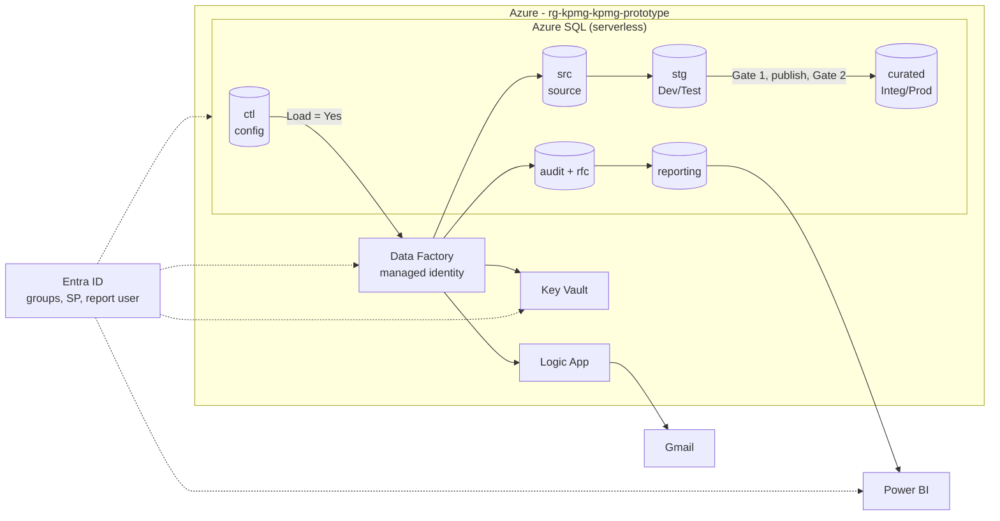

# Metadata-Driven Azure Data Pipeline

> One configuration-driven Azure pipeline that loads any table marked `Load = Yes`, detects source schema changes, waits for approval, checks the data at two gates, retries, alerts and reports its own health.


**Status:** live and verified in one Azure environment. Production networking and multi-environment promotion are designed, not provisioned.

**Contents:** [Problem](#problem) · [Solution](#solution) · [Architecture](#architecture) · [Pipeline flow](#pipeline-flow) · [Requirements](#requirements-traceability) · [Live results](#live-results) · [Dashboard](#dashboard) · [Documents](#documents) · [Repo map](#repo-map) · [Quick start](#quick-start)

---

## Problem

- The client's on-prem source tables change shape without warning.
- They want **one pipeline** driven by a **configuration table**: every row with `Load = Yes` is loaded.
- It must handle **first and incremental loads**.
- **Schema changes** need an **alert** and **human approval**; if rejected, keep loading the old shape.
- Data must be **checked at Dev/Test and Integ/Prod**, with **success and failure messages** and **retries**.
- Access must be **secure** for internal and external users.

## Solution

- **One reusable pipeline:** ADF Lookup (`Load = Yes`) → ForEach → one parameterised child pipeline.
- **Adding a table** takes one config row; no new pipeline.
- **Load types:** `FULL` reload or `WATERMARK` delta (watermark captured before loading).
- **Schema detection:** a SHA-256 fingerprint of each table's columns, compared with the last approved version.
- **Approval workflow:** `PENDING` / `APPROVED` / `REJECTED`; the first load is recorded as `INITIAL_LOAD`.
- **Safe by default:**
  - While a change is pending or rejected, the old approved columns are loaded.
  - If an approved column is removed or renamed, only that table fails; the target stays untouched.
- **Two quality gates:**
  - **Gate 1** (source → `stg`): row count, duplicate or null keys, schema.
  - **Gate 2** (`stg` → `curated`): keys published, duplicates or nulls, row count. A failure rolls back.
- **Resilience:** 3 retries per table; failures stay isolated; reruns never duplicate data.
- **Alerts:** Gmail emails for success, schema change and failure, sent through a Logic App (email can never fail a load).
- **Security:**
  - Entra-only SQL and ADF managed identity.
  - Key Vault with RBAC.
  - 4 Entra groups, a service principal, and a read-only report user.
- **Delivery:** Bicep IaC, GitHub Actions PR checks, Power BI health report.

## Architecture



- **KPMG mapping:** `src` = Source Prod · `stg` + Gate 1 = Dev/Test · `curated` + Gate 2 = Integ/Prod.
- **Not provisioned (cost):** VNet, private endpoints, VPN, firewall, SHIR, separate environments.
- More detail: [docs/ARCHITECTURE.md](docs/ARCHITECTURE.md)

## Pipeline flow


## Live results

| # | Scenario | Result |
|---|---|---|
| 1 | First load | ✅ Both tables loaded; `Load = No` skipped; gates pass |
| 2 | Incremental | ✅ Only 2 changed rows loaded |
| 3 | Rerun | ✅ 0 new rows, no duplicates |
| 4 | New column → approved | ✅ Schema v2 with `RegionCode` |
| 5 | New column → rejected | ✅ Old columns kept |
| 6 | Renamed column | ✅ That table failed after 4 attempts with alerts; the other table succeeded; data untouched |
| 7 | Restore and rerun | ✅ Both tables succeed |

Screenshots and run IDs: [docs/EVIDENCE.md](docs/EVIDENCE.md)

## Dashboard


- Shows configured and enabled tables, run outcomes, pending changes, gate failures, retries, and per-table health.
- Reads only the `reporting` schema, as a read-only Entra user.

## Documents

| Document | What's inside |
|---|---|
| [ARCHITECTURE.md](docs/ARCHITECTURE.md) | Diagrams, components, security, IP plan, production design |
| [DESIGN_DECISIONS.md](docs/DESIGN_DECISIONS.md) | Choices, trade-offs, flow issues in case study, limitations |
| [CICD_PROMOTION.md](docs/CICD_PROMOTION.md) | PR checks and Dev → Prod promotion |
| [EVIDENCE.md](docs/EVIDENCE.md) | Screenshots grouped by topic |

## Repo map

```text
.github/workflows/   PR validation
adf/                 Data Factory pipelines, dataset, linked services
infra/               Bicep (SQL, ADF, Key Vault, Logic App, Gmail)
sql/                 framework, procedures, security, views, demo/
scripts/             post-provision and ADF deploy
tests/               static and scenario checks
powerbi/             Power BI project
screenshots/         evidence
docs/                documentation
```

## Quick start

```powershell
az login
azd env new <env-name>
azd provision                 # infra + SQL (scripts/postprovision.ps1)
./scripts/deploy-adf.ps1 -SubscriptionId <id> -ResourceGroup <rg> -FactoryName <adf> `
  -SqlServerFqdn <fqdn> -SqlDatabaseName <db> -KeyVaultName <kv>
```

- Trigger `MasterMetadataDriven` in ADF Studio.
- Replay the scenarios with `sql/demo/00`–`07` (reset, incremental, pending, approve, reject, breaking, restore).

## Requirements traceability

✅ done and verified live · 🟡 partly done or designed only

### Pipeline

| Requirement | Status | How | Evidence |
|---|---|---|---|
| Dynamic, config-driven pipeline | ✅ | Lookup → ForEach → one child pipeline | [ADF pipelines](docs/EVIDENCE.md#data-factory) |
| `Load = Yes` rows loaded, `No` skipped | ✅ | Literal `Load` filter | [Config table](docs/EVIDENCE.md#sql-results) |
| Initial and subsequent loads | ✅ | First-load detection; FULL / WATERMARK | [Runs 1–3](docs/EVIDENCE.md#live-runs) |
| Step 1.1: create schema + RFC on first load | ✅ | Schema v1 + `INITIAL_LOAD` approval | [RFC table](docs/EVIDENCE.md#sql-results) |
| Step 4: detect schema change | ✅ | SHA-256 column fingerprint | [RFC table](docs/EVIDENCE.md#sql-results) |
| Step 4.2: alert + approval | ✅ | RFC `PENDING` + Gmail alert | [Alerts](docs/EVIDENCE.md#notifications) |
| Step 5: approved → new schema | ✅ | `rfc.usp_DecideSchemaChange`, version 2 | [Curated](docs/EVIDENCE.md#sql-results) |
| Step 5.1: rejected → old schema only | ✅ | Approved columns reused | [Run 5](docs/EVIDENCE.md#live-runs) |
| Step 2: source vs Dev/Test match | ✅ | Gate 1 on `stg` | [Gates](docs/EVIDENCE.md#sql-results) |
| Step 3: Dev/Test vs Integ/Prod match | 🟡 | Gate 2 `stg` vs `curated`, in one environment | [Gates](docs/EVIDENCE.md#sql-results) |
| Step 3.1: success message | ✅ | `TABLE_SUCCESS` email | [Alerts](docs/EVIDENCE.md#notifications) |
| Retry + alert on failure | ✅ | Retry ×3; `TABLE_FAILURE` email | [Run 6](docs/EVIDENCE.md#live-runs) |
| Azure SQL + Data Factory | ✅ | Deployed with Bicep | [Resources](docs/EVIDENCE.md#azure-resources) |
| Plain-English explanation | ✅ | README problem and solution sections | [README](#problem) |
| Call out process-flow issues | ✅ | 10 issues + fixes | [Design decisions](docs/DESIGN_DECISIONS.md#issues-found-in-kpmgs-process-flow) |
| Screenshots of each step | ✅ | Evidence gallery | [EVIDENCE.md](docs/EVIDENCE.md) |

### Access and control

| Requirement | Status | How | Evidence |
|---|---|---|---|
| Network configuration (VPN / Direct Connect) | 🟡 | Designed; prototype uses narrow public firewalls | [Architecture](docs/ARCHITECTURE.md#production-design-not-provisioned) |
| IP addressing | 🟡 | Non-overlapping plan, not deployed | [IP plan](docs/ARCHITECTURE.md#ip-address-plan-non-overlapping) |
| Firewalls | ✅ | SQL + Key Vault allow selected networks only | [Networking](docs/EVIDENCE.md#azure-resources) |
| RBAC | ✅ | Group roles on the resource group; SQL database roles | [Key Vault IAM](docs/EVIDENCE.md#identity-and-access) |
| IAM + MFA | ✅ | Entra-only SQL; security defaults on | [MFA](docs/EVIDENCE.md#identity-and-access) |
| Security groups | ✅ | Admins, Developers, Support, Report readers | [Groups](docs/EVIDENCE.md#identity-and-access) |
| Permissions to groups | ✅ | Roles assigned to groups only | [Key Vault IAM](docs/EVIDENCE.md#identity-and-access) |
| Service principal via app registration | ✅ | Secret in Key Vault; reads `reporting` only | [App registration](docs/EVIDENCE.md#identity-and-access) |
| Internal and external users | 🟡 | Read-only report user; external guests via Entra B2B (designed) | [Architecture](docs/ARCHITECTURE.md#security) |
| Dev → Test → Integ → Prod | 🟡 | PR checks live; promotion designed | [CI/CD](docs/CICD_PROMOTION.md) |
