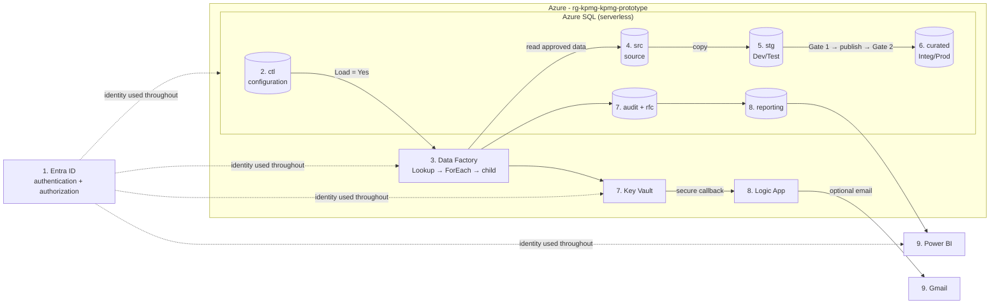
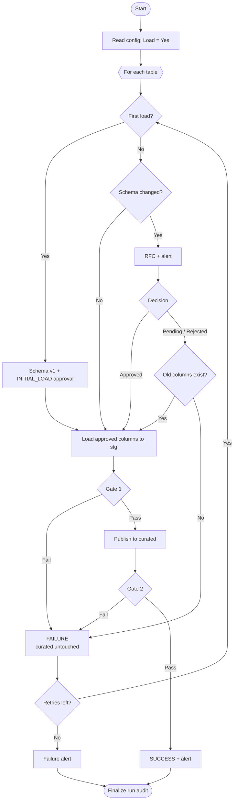
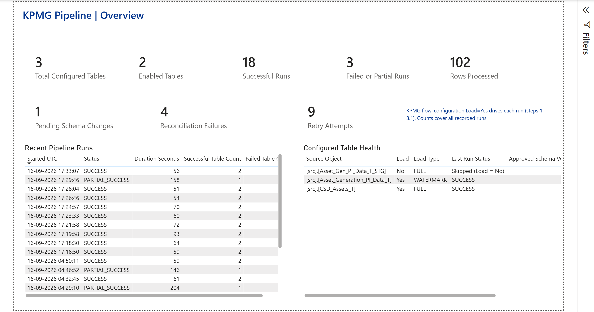

# Metadata-Driven Azure Data Pipeline

> One configuration-driven Azure pipeline that loads any table marked `Load = Yes`, detects source schema changes, waits for approval, checks the data at two gates, retries, alerts and reports its own health.


**Status:** live and verified in one Azure environment. Production networking and multi-environment promotion are designed, not provisioned.

**Contents:** [Problem](#problem) · [Solution](#solution) · [Architecture](#architecture) · [Pipeline flow](#pipeline-flow) · [Requirements](docs/REQUIREMENTS_TRACEABILITY_MATRIX.md) · [Live results](#live-results) · [Dashboard](#dashboard) · [Documents](#documents) · [Repo map](#repo-map) · [Quick start](#quick-start)

---

## Problem

- The client's on-prem source tables change shape without warning.
- They want **one pipeline** driven by a **configuration table**: every row with `Load = Yes` is loaded.
- It must handle **first and incremental loads**.
- **Schema changes** need an **alert** and **human approval**; if rejected, keep loading the old shape.
- Data must be **checked at Dev/Test and Integ/Prod**, with **success and failure messages** and **retries**.
- Access must be **secure** for internal and external users.

## Solution

- **One reusable pipeline:** ADF Lookup (`Load = Yes`) → ForEach → one parameterised child pipeline.
- **Adding a table** takes one config row; no new pipeline.
- **Load types:** `FULL` reload or `WATERMARK` delta (watermark captured before loading).
- **Schema detection:** a SHA-256 fingerprint of each table's columns, compared with the last approved version.
- **Approval workflow:** `PENDING` / `APPROVED` / `REJECTED`; the first load is recorded as `INITIAL_LOAD`.
- **Safe by default:**
  - While a change is pending or rejected, the old approved columns are loaded.
  - If an approved column is removed or renamed, only that table fails; the target stays untouched.
- **Two quality gates:**
  - **Gate 1** (source → `stg`): row count, duplicate or null keys, schema.
  - **Gate 2** (`stg` → `curated`): keys published, duplicates or nulls, row count. A failure rolls back.
- **Resilience:** 3 retries per table; failures stay isolated; reruns never duplicate data.
- **Alerts:** ADF sends success, schema-change and failure events to a Logic App. The optional Gmail action was validated separately; its 202-first design means email delivery does not control the table-load result.
- **Security:**
  - Entra-only SQL and ADF managed identity.
  - Key Vault with RBAC.
  - 4 Entra groups, a service principal, and a read-only report user. Group-only SQL reporting access is a production target, not proven by the checked-in evidence.
- **Delivery:** Bicep IaC, GitHub Actions PR checks, Power BI health report.

## Architecture



Read the numbers in order. When the same number appears twice, the flow has split into parallel/supporting branches:

1. **Entra ID** establishes who may access ADF, SQL, Key Vault and Power BI. This is a security prerequisite; business data does not flow through Entra ID.
2. **Configuration** identifies rows where `Load = Yes` and describes how each table should load.
3. **ADF** reads those rows, loops over the enabled tables and invokes the reusable child process.
4. **Source (`src`)** supplies only the previously approved columns and the required FULL or WATERMARK rows.
5. **Staging (`stg`)** receives those rows and Gate 1 validates source versus staging.
6. **Curated** receives the transactional publish and Gate 2 validates staging versus curated.
7. The flow splits: **audit/RFC** records the result and schema decisions, while **Key Vault** securely supplies the Logic App callback.
8. The branches continue: **reporting views** prepare operational metrics, while the **Logic App** accepts the notification event.
9. **Power BI** displays pipeline health; the optional **Gmail** action sends the operational message. These are outputs, not data-processing stages.

- **KPMG mapping:** `src` = Source Prod · `stg` + Gate 1 = Dev/Test · `curated` + Gate 2 = Integ/Prod.
- **Not provisioned (cost):** VNet, private endpoints, VPN/ExpressRoute, Azure Firewall appliance, SHIR and separate environments. SQL and Key Vault resource firewalls **are** provisioned.
- More detail: [docs/ARCHITECTURE.md](docs/ARCHITECTURE.md)

## Pipeline flow



## Live results

| # | Scenario | Result |
|---|---|---|
| 1 | First load | ✅ Both tables loaded; `Load = No` skipped; gates pass |
| 2 | Incremental | ✅ Only 2 changed rows loaded |
| 3 | Rerun | ✅ 0 new rows, no duplicates |
| 4 | New column → approved | ✅ Schema v2 with `RegionCode` |
| 5 | New column → rejected | ✅ Old columns kept |
| 6 | Renamed column | ✅ That table failed after 4 attempts with alerts; the other table succeeded; data untouched |
| 7 | Restore and rerun | ✅ Both tables succeed |

Screenshots and run IDs: [docs/EVIDENCE.md](docs/EVIDENCE.md)

## Dashboard



- Shows configured and enabled tables, run outcomes, pending changes, gate failures, retries, and per-table health.
- Uses read-only reporting views; the checked-in SQL grant targets the reporting service principal. The report-reader Entra group-to-SQL mapping is not proven by the repository.

## Documents

| Document | What's inside |
|---|---|
| [INTERVIEW_MASTER_GUIDE.md](docs/INTERVIEW_MASTER_GUIDE.md) | Main learning path from beginner concepts through implementation and production trade-offs |
| [INTERVIEW_CHEAT_SHEET.md](docs/INTERVIEW_CHEAT_SHEET.md) | Rapid revision, key answers and limitations |
| [MOCK_INTERVIEW_QUESTION_BANK.md](docs/MOCK_INTERVIEW_QUESTION_BANK.md) | Sixty questions from fundamentals to senior-engineer challenges |
| [PRESENTATION_RUNBOOK.md](docs/PRESENTATION_RUNBOOK.md) | 10/15/20-minute presentation and safe live-demo sequence |
| [ARCHITECTURE.md](docs/ARCHITECTURE.md) | Diagrams, components, security, IP plan, production design |
| [DESIGN_DECISIONS.md](docs/DESIGN_DECISIONS.md) | Choices, trade-offs, flow issues in case study, limitations |
| [CICD_PROMOTION.md](docs/CICD_PROMOTION.md) | PR checks and Dev → Prod promotion |
| [REQUIREMENTS_TRACEABILITY_MATRIX.md](docs/REQUIREMENTS_TRACEABILITY_MATRIX.md) | Every KPMG requirement → how it was met → evidence |
| [EVIDENCE.md](docs/EVIDENCE.md) | Screenshots grouped by topic |
| [DOCUMENTATION_INVENTORY.md](docs/DOCUMENTATION_INVENTORY.md) | Artifact audit, authoritative sources and known coverage gaps |

## Repo map

```text
.github/workflows/   PR validation
adf/                 Data Factory pipelines, dataset, linked services
infra/               Bicep (SQL, ADF, Key Vault, Logic App, Gmail)
sql/                 framework, procedures, security, views, demo/
scripts/             post-provision and ADF deploy
tests/               static and scenario checks
powerbi/             Power BI project
screenshots/         evidence
docs/                documentation
```

## Quick start

```powershell
az login
azd env new <env-name>
azd provision                 # infra + SQL (scripts/postprovision.ps1)
./scripts/deploy-adf.ps1 -SubscriptionId <id> -ResourceGroup <rg> -FactoryName <adf> `
  -SqlServerFqdn <fqdn> -SqlDatabaseName <db> -KeyVaultName <kv>
```

- Trigger `MasterMetadataDriven` in ADF Studio.
- Replay the scenarios with `sql/demo/00`–`07` (reset, incremental, pending, approve, reject, breaking, restore).
