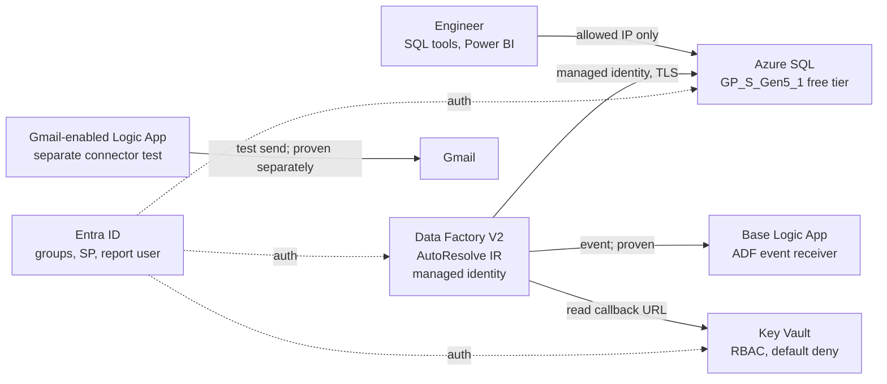
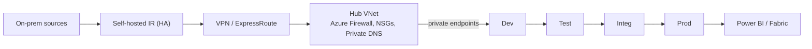

# Architecture

[← README](../README.md)

## Prototype (deployed)

- **Region:** Canada Central · **Resource group:** `rg-kpmg-kpmg-prototype`
- **Resources:** Data Factory, SQL server + database, Key Vault, two Consumption Logic App resources visible in the final resource-group capture, and a Gmail API connection. The second workflow was used to verify the Gmail action; consolidate to one workflow in production.
- **Cost evidence:** CA$0.23 was observed in the 2026-09-16 capture; this is historical evidence, not a continuing price quote. SQL uses the free allowance and auto-pauses when that allowance is exhausted.

## Components

| Component | Role |
|---|---|
| Data Factory | Master pipeline (Lookup → ForEach → finalize) + child pipeline (process, retry ×3, notify) |
| Azure SQL | Source, config, staging, curated, audit, RFC and reporting, all in one database |
| Stored procedure `ctl.usp_ProcessConfiguredTable` | Schema check, load, gates, publish, audit |
| Key Vault | Logic App callback URL and the service principal's secret |
| Logic Apps | Base workflow receives ADF events and replies 202; a separate Gmail-enabled workflow validates email sending. One ADF-originated email trace is not captured end to end. |
| Power BI Desktop | Pipeline health report over `reporting` views |

## Database layout

| Schema | Purpose | KPMG stage |
|---|---|---|
| `src` | Synthetic source tables (KPMG table names) | Source Prod |
| `ctl` | `PipelineConfiguration`: table, `Load`, load type, key, watermark, approved schema | Configuration table |
| `stg` | Per-run staging copy + Gate 1 | Dev/Test |
| `curated` | Published tables + Gate 2 | Integ/Prod |
| `audit` | Pipeline runs, table attempts, gate checks, notifications | Evidence |
| `rfc` | Schema change requests + version history | Approval |
| `reporting` | Read-only views for Power BI | Consumption |

## Security

**Identity**
- Azure SQL accepts **Entra sign-in only** (no SQL passwords).
- ADF uses a **system-assigned managed identity** with a custom least-privilege SQL role.
- **MFA** is enforced through Entra security defaults.

**Groups (permissions go to groups, not people)**

| Group | Azure role (resource group) | SQL role |
|---|---|---|
| `grp-kpmg-admins` | Contributor | — |
| `grp-kpmg-developers` | Contributor | — |
| `grp-kpmg-support` | Reader | — |
| `grp-kpmg-report-readers` | — | Intended group boundary; group membership is evidenced, but group-to-SQL-role assignment is not proven by the repository |

**Service principal (KPMG page 4)**
- The app registration `sp-kpmg-report-reader-*` has a short-lived prototype secret. The screenshot shows that credential expired on 2026-09-18, so it must be rotated before reuse.
- `sql/005_reporting_identity.sql` grants the service principal SELECT on `reporting` through `db_kpmg_reporting_reader`. It does not grant the Entra reader group; group-only SQL access remains unverified in the checked-in evidence.
- **Why managed identity is preferred:** there's no secret to store, rotate or leak. A service principal is only for clients outside Azure.

**Secrets and network**
- No secret values live in Git or in the config table; Key Vault uses RBAC and a default-deny firewall.
- SQL and Key Vault are public endpoints limited to one client IP, plus the Azure-services exception that ADF needs.

## Production design (not provisioned)

- A separate ADF, SQL database and Key Vault for each environment, promoted by CI/CD ([CICD_PROMOTION.md](CICD_PROMOTION.md)).
- Private endpoints with public access disabled.
- Conditional Access, PIM and access reviews.
- Log Analytics alerts and ITSM integration.
