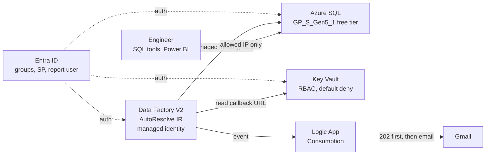
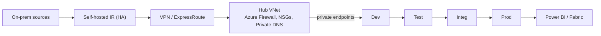

# Architecture

[← README](../README.md)

## Prototype (deployed)

- **Region:** Canada Central · **Resource group:** `rg-kpmg-kpmg-prototype`
- **Resources:** Data Factory, SQL server + database, Key Vault, Logic App, Gmail API connection.
- **Cost:** about CA$0.23 so far; SQL runs on the free allowance and auto-pauses.

## Components

| Component | Role |
|---|---|
| Data Factory | Master pipeline (Lookup → ForEach → finalize) + child pipeline (process, retry ×3, notify) |
| Azure SQL | Source, config, staging, curated, audit, RFC and reporting, all in one database |
| Stored procedure `ctl.usp_ProcessConfiguredTable` | Schema check, load, gates, publish, audit |
| Key Vault | Logic App callback URL and the service principal's secret |
| Logic App | Replies 202 to ADF, then sends a Gmail alert |
| Power BI Desktop | Pipeline health report over `reporting` views |

## Database layout

| Schema | Purpose | KPMG stage |
|---|---|---|
| `src` | Synthetic source tables (KPMG table names) | Source Prod |
| `ctl` | `PipelineConfiguration`: table, `Load`, load type, key, watermark, approved schema | Configuration table |
| `stg` | Per-run staging copy + Gate 1 | Dev/Test |
| `curated` | Published tables + Gate 2 | Integ/Prod |
| `audit` | Pipeline runs, table attempts, gate checks, notifications | Evidence |
| `rfc` | Schema change requests + version history | Approval |
| `reporting` | Read-only views for Power BI | Consumption |

## Security

**Identity**
- Azure SQL accepts **Entra sign-in only** (no SQL passwords).
- ADF uses a **system-assigned managed identity** with a custom least-privilege SQL role.
- **MFA** is enforced through Entra security defaults.

**Groups (permissions go to groups, not people)**

| Group | Azure role (resource group) | SQL role |
|---|---|---|
| `grp-kpmg-admins` | Contributor | — |
| `grp-kpmg-developers` | Contributor | — |
| `grp-kpmg-support` | Reader | — |
| `grp-kpmg-report-readers` | — | `db_kpmg_reporting_reader` (SELECT on `reporting`) |

**Service principal (KPMG page 4)**
- The app registration `sp-kpmg-report-reader-*` has a short-lived client secret stored in Key Vault.
- It can read `reporting`; access to `curated` was tested and denied.
- **Why managed identity is preferred:** there's no secret to store, rotate or leak. A service principal is only for clients outside Azure.

**Secrets and network**
- No secrets live in Git or in the config table; Key Vault uses RBAC and a default-deny firewall.
- SQL and Key Vault are public endpoints limited to one client IP, plus the Azure-services exception that ADF needs.

## Production design (not provisioned)

- A separate ADF, SQL database and Key Vault for each environment, promoted by CI/CD ([CICD_PROMOTION.md](CICD_PROMOTION.md)).
- Private endpoints with public access disabled.
- Conditional Access, PIM and access reviews.
- Log Analytics alerts and ITSM integration.