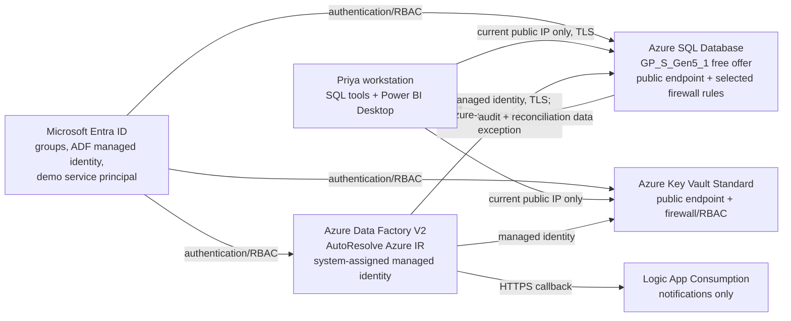
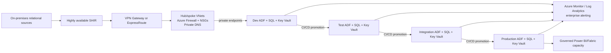

# Architecture

**Status:** revised pre-deployment design; awaiting Priya's approval. Nothing in this document is deployment evidence.

## Implemented prototype target (to be provisioned only after approval)

The one reduced-cost environment logically demonstrates the KPMG stages rather than pretending four environments exist:

- `src` represents the source-production relational tables and synthetic changes.
- `stg` plus reconciliation represents Dev/Test and the first data-match gate.
- `curated` plus reconciliation represents Integration/Production and the second gate.
- SQL configuration, schema history, RFC, run-audit, table-audit, and reconciliation tables control and evidence the flow.
- Power BI Desktop reads curated/audit views locally; no cloud Power BI or Fabric capacity is provisioned.

The prototype intentionally has **no VNet, NSG, private endpoint, Private DNS, Storage Account, Log Analytics workspace, paid Power BI capacity, or paid Fabric capacity**. These are not hidden dependencies.

## End-to-end viability

1. ADF's AutoResolve Azure Integration Runtime reads enabled configuration rows.
2. Parameterized datasets and a `ForEach` process each table using Azure SQL public FQDNs.
3. The ADF managed identity authenticates to Azure SQL; no SQL password is stored in configuration.
4. Azure SQL's public endpoint is limited to Priya's current public IP plus the Azure-services firewall exception needed by the multitenant Azure IR. TLS and least-privilege database roles remain mandatory.
5. The pipeline detects first/subsequent load and schema differences, records an RFC, follows the previously approved projection while an RFC is pending/rejected when compatible, loads staging/curated data idempotently, reconciles it, and audits the result.
6. A Consumption Logic App sends success/failure/schema-change notifications; the SQL RFC table remains the approval system of record.
7. Power BI Desktop connects from Priya's allowed IP and reports pipeline health locally.

This works without the five prohibited resources. The public Azure IR does not have a stable dedicated outbound IP, so the prototype requires SQL's **Allow Azure services and resources to access this server** exception. If tenant policy prohibits that control, deployment must stop; a self-hosted integration runtime or managed private networking would be a separately approved redesign, not a silent addition.

## Recommended for Production — Not Provisioned in Case-Study Prototype

Production should evaluate isolated environments/subscriptions, private endpoints and Private DNS, VPN/ExpressRoute, Azure Firewall, a resilient SHIR, centralized monitoring, enterprise ITSM integration, and licensed Power BI/Fabric sharing. Every item in this paragraph is **DOCUMENTED ONLY — NOT PROVISIONED** for the case-study prototype.

## Canonical resource inventory

The exact SKU, cost behavior, reason, and YES/NO decision for every planned or excluded resource is in [AZURE_RESOURCES.md](AZURE_RESOURCES.md).
