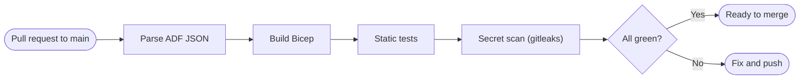
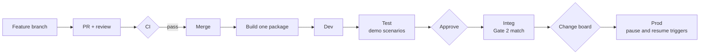
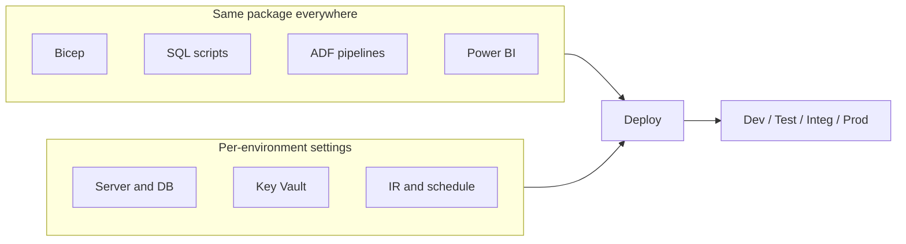
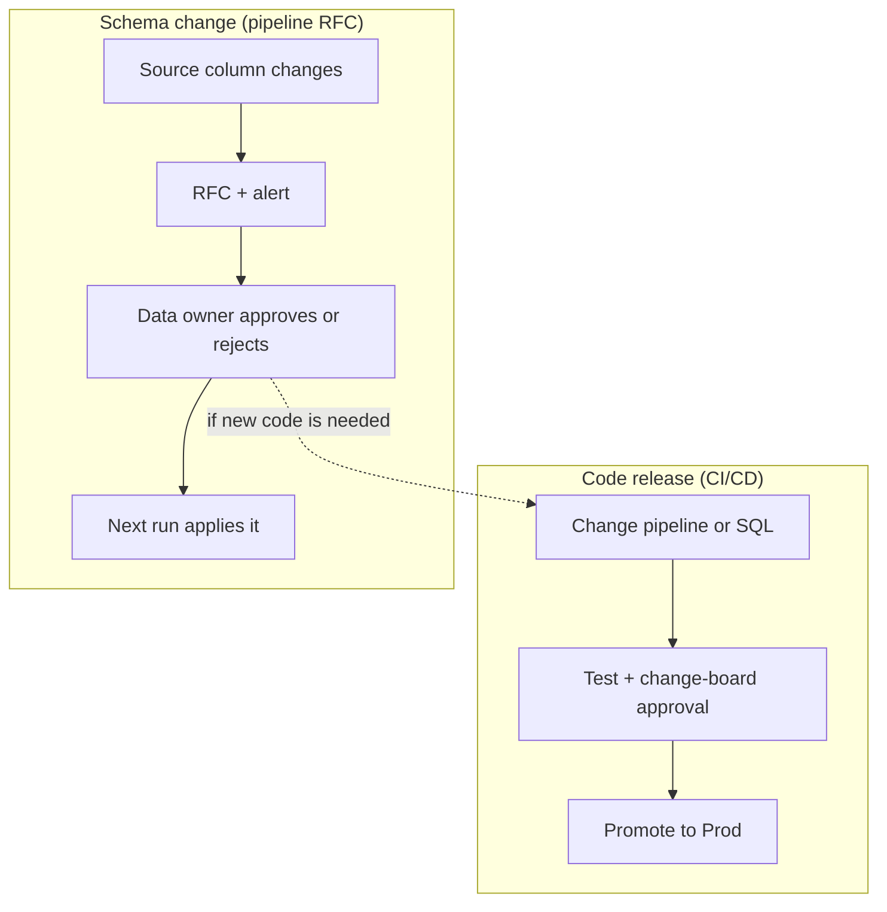

# CI/CD and Environment Promotion

[← README](../README.md)

- **Live:** pull-request checks in [.github/workflows/ci.yml](../.github/workflows/ci.yml).
- **Designed only:** promoting one package through Dev → Test → Integ → Prod.
- **Why it matters:** KPMG's diagram shows Dev → Test → Integ → Prod joined by a *deployment pipeline*, with changes built and tested in Test before they're deployed.

## Pull-request checks (live)

- No cloud login and no deployment, so the checks are safe and free.

## Promotion flow (designed)

- **Build once, promote the same package:** what was tested is exactly what reaches Prod.
- **Only settings change per environment:** SQL server, Key Vault, integration runtime, alert recipients, schedule.
- **No stored secrets:** each environment has its own Key Vault, and the pipeline signs in with OIDC federation.

## What gets promoted

## Two separate approval tracks

## Prototype vs production

| Item | Prototype | Production |
|---|---|---|
| Environments | One | Dev, Test, Integ, Prod |
| Deployment | `azd provision` + script | GitHub Actions / Azure DevOps release |
| Approvals | — | Environment approval gates |
| Sign-in | Developer login | OIDC federated identity |
