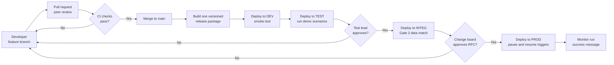
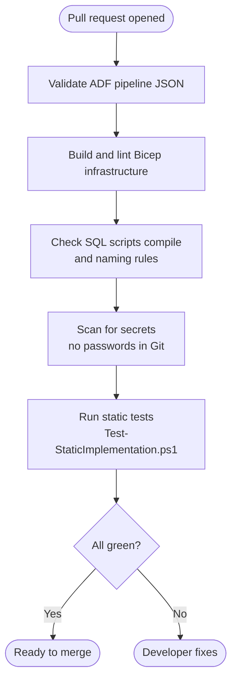
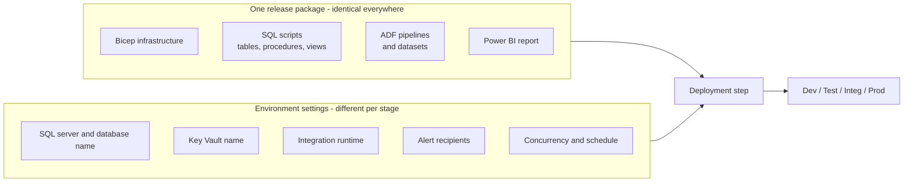
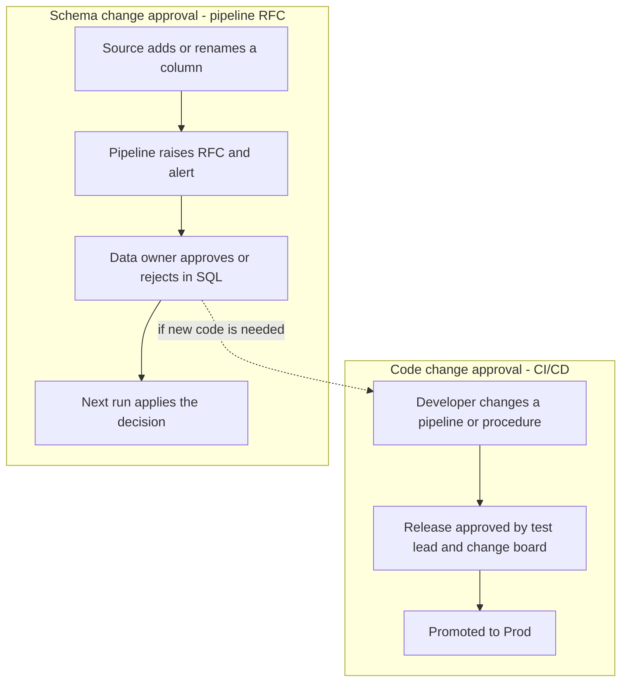

# CI/CD and Environment Promotion

Status: **DOCUMENTED ONLY - NOT PROVISIONED.** The prototype runs in one Azure environment to keep cost at zero. This page shows how the same code would move from Dev to Prod in a real KPMG client setup.

## What KPMG's use case shows

- Page 1 diagram: four workspaces (**Dev -> Test -> Integ -> Prod**) connected by a "Dev to Test Data Move" and a "Deployment Pipeline".
- Page 2 bottom lane: *Business-initiated change -> Developer makes and tests the change in Test -> Deploy the changes to the pipelines -> Rerun the pipeline*.

So KPMG expects code to be **built once, tested, approved, and promoted** through environments, never edited directly in Prod.

## Simple explanation

Think of it like publishing a book. The author writes a draft (**Dev**), an editor checks it (**Test**), a proof copy is printed and compared with the draft (**Integ**), and only then is it sold in shops (**Prod**). The *same* manuscript moves forward. Nobody rewrites it at the printing press.

## 1. The promotion flow

## 2. What the CI checks do (before merge)

## 3. What gets promoted, and what changes per environment

Secrets are **never** in the package. Each environment has its own Key Vault, and the pipeline signs in with a **federated identity** (no stored password).

## 4. Two different approvals - don't mix them up

## Mapping to KPMG and to this prototype

| KPMG item | Production design | Prototype today |
|---|---|---|
| Dev / Test / Integ / Prod | Separate resource groups or subscriptions, same package | One environment (cost choice) |
| Deployment pipeline | GitHub Actions or Azure DevOps, one build promoted | Manual `azd up` + `scripts/deploy-adf.ps1` |
| Developer tests change in Test | Automated scenario tests in Test | Live demo scenarios run in the one environment |
| Deploy changes to pipelines | ADF published by release, triggers paused/resumed | ADF published by script |
| Approval | GitHub Environments / Azure DevOps approval gates | Documented only |
| Secrets | Per-environment Key Vault, OIDC federated sign-in | Key Vault used; OIDC not configured |

## Talking points

1. "We build once and promote the same package, so what we tested is exactly what reaches Prod."
2. "Only environment settings change between stages. Secrets live in each environment's Key Vault."
3. "Pull requests run automatic checks, so broken JSON, bad SQL or leaked secrets never reach main."
4. "There are two approval tracks: the release approval for code, and the RFC approval for source schema changes. KPMG's bottom lane connects them."
5. "For cost, the prototype has one environment. The scripts are parameterised, so adding Test, Integ and Prod means new parameter files, not new code."
