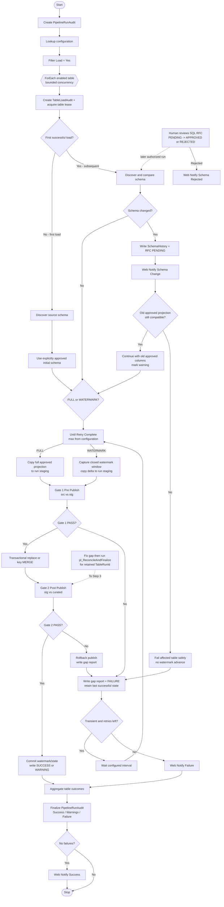

# KPMG Dynamic Data Pipeline - Proposed Design and Approval Checkpoint

Status: Revised design only, awaiting Priya's approval. No Azure implementation, deployment, authentication, or GitHub push has been authorized. The Azure Free Account guardrails in `AZURE_RESOURCES.md` supersede earlier private-endpoint planning.

Target deadline supplied by Priya: 2:00 PM EST, 2026-09-16. For scheduling, this plan treats that as 2:00 PM Toronto local time; clarify if fixed UTC-5 was intended.

## 1. Understanding of the problem

KPMG requires a configuration-driven pipeline for relational tables whose source schemas can change unexpectedly. A table becomes eligible when its configuration row says `Load = Yes`. The solution must distinguish first and subsequent loads, detect schema changes, follow the supplied approval process, reconcile data at control gates, handle failures and retries, provide access securely to internal and external users, and be explainable to technical and non-technical stakeholders.

For the prototype, Priya has selected Azure Data Factory (ADF) plus Azure SQL Database in one reduced-cost environment. Synthetic relational source tables will stand in for an unspecified on-premises source. Production topology, security, and promotion across Dev/Test/Integration/Prod will be documented without creating four physical environments.

## 2. Requirement/design classification

- **[A - KPMG REQUIRED]** Dynamic configuration-driven eligibility, source-schema change handling, first/subsequent loads, success/failure handling, reconciliation decisions, RFC/approval, security/access design, documentation, and screenshots.
- **[B - KPMG RECOMMENDED]** Fabric for consistency with the client's medallion platform; it is not mandatory.
- **[C - APPROVED DIRECTION]** ADF + Azure SQL, one live prototype environment, Power BI consumption, SQL-backed RFC state, and synthetic relational data.
- **[D - PROTOTYPE ASSUMPTION]** Keys, watermarks, reconciliation rules, delete policy, reduced environment count, and external-user access pattern were not supplied by KPMG and must remain labeled as assumptions.

### Plain-English explanation for non-technical stakeholders

**[A - KPMG REQUIRED]** Think of the pipeline as a supervised delivery service. The configuration table is the delivery list: only tables marked `Yes` are collected. For each table, the service takes a snapshot of what it is allowed to carry, checks the package before it leaves the source area, delivers it to the approved destination, and checks it again after delivery. It records what happened at every step and sends a success or failure message.

If the source table changes shape, the pipeline treats that like receiving a package with an unexpected item. It records the difference and asks for approval. Until a decision is made, it can continue carrying only the previously approved columns when those columns still exist and remain safe to read. If that is impossible, it stops that table safely. Approval creates a new accepted version; rejection keeps the old approved version. Other independent tables can continue.

## 3. Selected architecture

### A. Source layer

- Prototype: representative tables in an Azure SQL `src` schema populated with synthetic data.
- At least one table demonstrates `WATERMARK` loading using a stable primary key plus `LastModifiedUtc`.
- At least one table demonstrates `FULL` loading to prove behavior when no reliable watermark exists.
- Hard-delete propagation for watermark tables is out of prototype scope; full snapshot loads reflect deletes. Production alternatives are SQL Change Tracking/CDC, soft-delete flags, or periodic full reconciliation.
- Production: the on-premises relational source is reached through self-hosted integration runtime (SHIR), ideally across site-to-site VPN or ExpressRoute/private routing.

#### KPMG environment-to-prototype mapping

**[C - PROPOSED DESIGN]** One physical development environment is used to meet the deadline and control cost; logical schemas and two reconciliation gates demonstrate the KPMG process without claiming that four environments were deployed.

| KPMG page 2 environment/stage | Prototype mapping | Reconciliation | Production mapping |
|---|---|---|---|
| Source Prod | Azure SQL `src` schema with synthetic source tables | Source side of gate 1 | Actual on-premises production source via SHIR |
| Fabric Dev/Test | Azure SQL run-scoped `stg` schema | `GATE_1_PRE_PUBLISH`: `src` vs `stg` | Separate Dev and Test ADF/SQL/Fabric-equivalent environments |
| Fabric Integ/Prod | Azure SQL `curated` schema | `GATE_2_POST_PUBLISH`: `stg` vs `curated` | Separate Integration and Production environments |
| Semantic/reporting layer | Azure SQL `reporting` views + Power BI | Reads only successfully published data | Production semantic model and governed Power BI app |

**[C - PROPOSED DESIGN]** Production promotes versioned ADF and SQL artifacts Dev -> Test -> Integration -> Prod with environment-specific parameters. Data is not copied from development into production merely to promote code.

### B. Metadata/configuration framework

`ctl.PipelineConfiguration` holds one validated row per source-to-target mapping. ADF reads enabled rows at run start and snapshots the relevant configuration into table-run audit records.

Justified fields:

| Field | Purpose |
|---|---|
| `ConfigId` | Stable configuration identity |
| `SourceConnectionRef` | Reference to an ADF linked service/connection definition; never a password |
| `SourceSchema`, `SourceTable` | Runtime source object identity |
| `TargetSchema`, `TargetTable` | Runtime target object identity |
| `Load` | Literal `Yes`/`No`, constrained by `CHECK ([Load] IN ('Yes','No'))`; directly implements KPMG's sample |
| `LoadType` | `FULL` or `WATERMARK` |
| `WatermarkColumn` | Required only for watermark strategy |
| `PrimaryKeyColumns` | Validated list used for uniqueness and idempotent merge |
| `ApprovedColumnList` | Last approved projection used while change is pending/rejected |
| `RetryCount`, `RetryIntervalSeconds` | Per-table bounded transient retry policy |
| `IsActive` | Soft retirement without deleting audit history |

Fields deliberately kept out of this table:

- `LastWatermarkValue`, `LastRunStatus`, and `LastSuccessfulRun` belong in mutable `ctl.TableLoadState`/audit tables, not design configuration.
- `SchemaVersion` belongs in schema history/state.
- Passwords, keys, and connection strings do not belong in SQL metadata. Managed identity is preferred; unavoidable secrets are referenced through Azure Key Vault.
- Arbitrary free-form SQL is avoided. Identifiers and supported options are validated to prevent injection and unreviewed behavior.

**[A - KPMG REQUIRED]** KPMG page 3 maps to the prototype as follows:

| KPMG column | Prototype mapping | Explanation |
|---|---|---|
| `Tables` | `SourceSchema` + `SourceTable` | Schema-qualified identity avoids name collisions. |
| `Columns` | `ApprovedColumnList` | The exact approved projection used by the dynamic copy. |
| `Load` | `Load` (`Yes`/`No`) | A literal text column is chosen instead of a bit so portal/SQL evidence matches KPMG exactly. A CHECK constraint prevents any third value. |
| `Connection Parameters` | `SourceConnectionRef` -> `ctl.ConnectionReference` | Resolves an approved ADF linked-service name and non-secret database metadata. Credentials never appear in the table. |

Sample rows to be implemented:

| SourceTable | ApprovedColumnList | Load | SourceConnectionRef | LoadType |
|---|---|---|---|---|
| `Asset_Generation_PI_Data_T` | `AssetId,GenerationDate,GenerationMWh,LastModifiedUtc` | `Yes` | `SRC_AZURESQL_PROTO` | `WATERMARK` |
| `Asset_Gen_PI_Data_T_STG` | `AssetId,GenerationDate,GenerationMWh` | `No` | `SRC_AZURESQL_PROTO` | `FULL` |
| `CSD_Assets_T` | `AssetId,AssetName,AssetType,Status` | `Yes` | `SRC_AZURESQL_PROTO` | `FULL` |

### C. Dynamic ingestion and orchestration

One master pipeline performs:

1. Create pipeline-run audit record.
2. Lookup all active rows where `[Load] = 'Yes'`.
3. ForEach configuration snapshot with bounded concurrency.
4. Invoke common per-table processing using parameters rather than table-specific pipelines.
5. Inspect source schema and load state.
6. Select first/full/watermark path.
7. Compare current schema with the last approved schema.
8. Load to run-scoped staging using the approved projection.
9. Run `GATE_1_PRE_PUBLISH` reconciliation between `src` and `stg`.
10. Publish to curated target atomically/idempotently and run `GATE_2_POST_PUBLISH` between `stg` and `curated` inside the controlled publish boundary.
11. Update watermark only after both gates pass.
12. Finalize table and pipeline audit status and send the required success/failure/schema notification.

Adding a valid enabled configuration row therefore requires metadata and target authorization, not a new ADF pipeline.

### D. Initial load

First load is identified by the absence of both an approved schema version and a successfully published `TableLoadState`; target row count is not used because an empty/partially failed target is not proof of first use.

Flow:

1. Capture source schema as a candidate schema.
2. Create the initial RFC/approval record if following the same approval governance for initial schema; the prototype can seed this as explicitly approved during setup.
3. Create/prepare target and run-scoped staging table from the approved column definition.
4. Copy the full approved projection.
5. Run mandatory reconciliation.
6. Publish target only after `PASS`.
7. Persist approved schema, load state, and audit evidence.

### E. Subsequent/incremental load

- `FULL`: reload a run-scoped staging table, validate it, then replace/publish in a controlled transaction. This handles tables without trustworthy delta metadata and naturally reflects deletes.
- `WATERMARK`: read the last committed watermark, capture a new upper bound at run start, extract only rows in the closed window, stage, validate, and `MERGE` by stable primary key. Advance the watermark only after successful publish.
- A timestamp/key tie-breaker or controlled lookback plus key-based `MERGE` prevents equal-timestamp rows from being missed. The prototype schema will include stable keys and a sufficiently precise `LastModifiedUtc`; this is a design assumption, not a KPMG requirement.
- A failed rerun reuses the same window or re-extracts overlapping rows into run-scoped staging; idempotent merge prevents duplicates.

### F/G/H. Schema detection, evolution, and RFC handling

Source metadata is normalized by ordinal, column name, source datatype, length/precision/scale, and nullability. The ordered definition is hashed. A changed hash triggers a detailed comparison and creates a `PENDING` RFC record.

Prototype governance rule: **every detected schema change requires approval**, including safe additions. The current run continues with the last approved projection when technically compatible, logs a warning/schema-change event, and does not expose the new schema.

Safety guard: if an approved source column was removed/renamed or no longer converts to the approved target type, the old projection cannot be executed honestly. The affected table fails safely and remains blocked pending correction/approval; the framework will not invent values or silently corrupt data.

RFC states:

- `PENDING`: change detected, old compatible projection continues with `WARNING`; incompatible projection fails safely.
- `APPROVED`: reviewed DDL/mapping becomes the next approved schema version; a new run applies it and then loads.
- `REJECTED`: new schema is not adopted; old compatible projection remains active and the event is retained.

The ADF run does not wait indefinitely for a human. Approval is durable SQL state; a later run resumes after approval.

#### Page 2 step 5 interpretation and operational deviation

**[A - KPMG REQUIRED, CLARIFIED BY PRIYA]** Priya confirmed that pending or rejected changes must not be adopted and that processing should continue through step 4.1 using only the old approved columns when compatible. This is not treated as a deviation from the agreed business behavior, despite the original drawing's ambiguous branch placement.

**[C - DELIBERATE OPERATIONAL DEVIATION]** The prototype does not hold one ADF run open while a person decides. It writes durable `PENDING` state, sends step 4.2 notification, completes the table with `WARNING` using the compatible old projection, and evaluates the decision on a later run. This avoids run timeouts and creates a clear audit trail.

**[A - KPMG REQUIRED]** On `REJECTED`, step 5.1 sends `SCHEMA_REJECTED`: change request ID, table, detected differences, decision/approver/time, confirmation that the proposed schema was not adopted, and whether old-schema loading remains compatible. The rejected schema remains immutable in history; the approved version does not change.

#### Schema-change classification

All categories require approval in the prototype. `Safe/auto-acceptable` describes a future optimization only.

| Change | Conceptual classification | Prototype behavior before approval | After approval |
|---|---|---|---|
| Add nullable column | Safe candidate for future auto-accept | Ignore new column; load approved projection; warning/RFC | Add target column and include in new version |
| Compatible datatype widening | Safe candidate after tested type mapping | Continue only if old target conversion is safe; warning/RFC | Alter target/mapping, version schema |
| Remove column | Breaking | Old projection is impossible if column is selected; fail table safely | Explicit downstream-impact decision; retain/deprecate target column or version contract |
| Rename column | Breaking; indistinguishable from remove+add without mapping | Fail if old name is no longer selectable | Approved rename mapping/DDL and consumer updates |
| Narrow/incompatible datatype change | Breaking | Fail preflight or conversion; do not use lossy conversion | Approved transform/remediation and target change |
| Nullable -> non-nullable | Breaking governance change | Old projection may run, but change still raises RFC | Approve constraint after null/backfill validation |
| Primary-key/watermark change | Breaking operational change | Stop incremental advancement | Rebaseline state and controlled reload |

Future optimization: configurable automatic acceptance of nullable added columns after compatibility testing. Benefit: less manual delay. Trade-off: downstream consumers can still break, so contract/dependency tests and opt-in policy are required.

### I. Data quality and reconciliation

**[A - KPMG REQUIRED]** KPMG page 2 contains two separate `Does Data match` decisions. Each table/run therefore records the same mandatory checks at two named stages in `audit.ReconciliationResult`:

- `GATE_1_PRE_PUBLISH`: compare the exact source extraction window in `src` with the rows in run-scoped `stg` before publish.
- `GATE_2_POST_PUBLISH`: compare the staged change set/snapshot with `curated` after the proposed publish. `usp_PublishAndGate2` performs publish and the gate-2 checks inside one SQL transaction so a gate-2 failure rolls back the consumer-visible change.

Each gate writes:

- Source rows in the exact extraction window.
- Staged/target affected rows.
- Rejected/error rows.
- Primary-key non-null completeness.
- Duplicate primary-key count.
- Required configured null checks.
- Current projection matches the approved schema/version.
- Optional business rules can be added later by a validated rule catalog.
- An optional deterministic checksum over approved columns for small prototype tables. It supplements rather than replaces key/count checks.

Status rules:

- `SUCCESS`: copy/publish succeeded and every mandatory reconciliation check passed.
- `WARNING`: data reconciled and published, but a non-blocking event exists, chiefly a pending/rejected additive schema change loaded through the old compatible projection.
- `FAILURE`: copy/publish failed; mandatory check failed; duplicate/non-null key violation exists; approved projection is unavailable/incompatible; or schema approval was applied unsuccessfully.

On either gate failure, SQL/ADF produces a data-quality gap result containing stage, check type, expected/actual value, affected table/run, and remediation status. The table is `FAILURE`; the publish transaction is not committed or is rolled back; the watermark is not advanced.

`To Step 3` is implemented as a controlled gate-2 recheck: after correction, `pl_ReconcileAndFinalize` receives the original `TableRunId` and reruns `GATE_2_POST_PUBLISH` against retained staging. If staging has expired or the configuration/schema version changed, the framework requires a full per-table rerun instead of reusing stale evidence.

### J. Audit/logging framework

- `PipelineRunAudit`: one orchestration invocation and its aggregate outcome.
- `TableLoadAudit`: one configuration item within one pipeline run, including the frozen configuration/schema version, row counts, timings, retry count, watermark window, and error summary.
- `ReconciliationResult`: check-level evidence and PASS/FAIL.
- `SchemaHistory`: immutable discovered/approved schema snapshots and hash.
- `SchemaChangeRequest`: RFC state, differences, approver, timestamps, and decision rationale.
- ADF diagnostic logs/Azure Monitor provide platform activity evidence; SQL audit tables provide business/table evidence.

### K/L. Error handling, retry, and recovery

- **[B - KPMG EXAMPLE MADE CONCRETE]** `RetryCount` defaults to `3`, meaning three retries after the initial attempt (four total attempts), and `RetryIntervalSeconds` defaults to `60`. Both are constrained configuration values.
- Retry only transient connectivity, HTTP 408/429, Azure SQL transient connectivity/throttling, and temporary service-unavailable failures. Do not retry authentication/authorization, invalid configuration, schema incompatibility, constraint, duplicate/key/null, or reconciliation failures.
- Because per-row activity retry policy is not reliably dynamic, `pl_ProcessTable` uses `Until_RetryComplete`: execute the worker, capture failure, classify it, increment `RetryAttempt`, wait the configured interval, and stop when success/non-retryable/exhausted. Each attempt is audited.
- When retries are exhausted, `Web_NotifyFailure` calls the shared notification Logic App with the final error and attempt count.
- Do not retry deterministic permission, configuration, schema compatibility, or reconciliation failures until corrected.
- Load into run-scoped staging; consumer-visible tables are changed only during publish.
- A table failure is caught, audited, and does not stop independent table iterations. The parent run is `FAILED` if any required table fails, or `SUCCEEDED_WITH_WARNINGS` if there are warnings but no failures.
- Prototype ForEach concurrency begins conservatively (for example, batch count 2-4) and is tuned from Azure SQL capacity/ADF metrics.
- Prevent overlapping processing of the same `ConfigId` through an active-run guard/lease in SQL.
- Rerun only failed configuration IDs or the full enabled set. Idempotent merge/full-snapshot publish prevents duplicates.

### Required notification contract

**[A - KPMG REQUIRED]** One Consumption Logic App with an authenticated HTTP trigger is the notification endpoint for success (step 3.1), failure after retries, schema change (step 4.2), and rejection/schema message (step 5.1). ADF invokes it through Web activities:

- `Web_NotifySuccess` after the overall run finalizes with no failures.
- `Web_NotifyFailure` after a non-retryable failure or retry exhaustion.
- `Web_NotifySchemaChange` immediately after the RFC record is created.
- `Web_NotifySchemaRejected` when an RFC becomes `REJECTED`; the message says the new schema was not adopted and identifies whether the old projection can continue.

Payload (no row data, credentials, or secrets):

```json
{
  "eventType": "PIPELINE_SUCCESS|PIPELINE_FAILURE|SCHEMA_CHANGE|SCHEMA_REJECTED",
  "severity": "INFO|WARNING|ERROR",
  "environment": "prototype",
  "eventUtc": "ISO-8601 UTC",
  "adfPipelineName": "string",
  "adfRunId": "string",
  "pipelineRunId": "GUID",
  "tableRunId": "GUID|null",
  "configId": "number|null",
  "sourceObject": "schema.table|null",
  "targetObject": "schema.table|null",
  "status": "string",
  "retryAttempt": "number",
  "sourceRowCount": "number|null",
  "targetRowCount": "number|null",
  "schemaChangeRequestId": "number|null",
  "errorCode": "string|null",
  "summary": "redacted string",
  "runbookUrl": "string|null"
}
```

The Logic App callback secret, if used, is stored in Key Vault and marked secure in ADF input/output. Production should prefer Entra-authenticated invocation and route to the client's approved email/Teams/ITSM channel.

### M. Target model

- `src`: synthetic source only in the prototype; represents on-premises input.
- `stg`: transient/run-scoped landing tables.
- `curated`: approved, consumer-facing relational tables.
- `ctl`: configuration and current operational state.
- `audit`: run and reconciliation history.
- `rfc`: schema-change decisions.
- `reporting`: secured views for Power BI pipeline-health reporting.

### N. Power BI/reporting

A small operational report demonstrates:

- Configured and enabled tables.
- Successful, warning, and failed table loads.
- Rows read/written/rejected.
- Last successful load and duration.
- Pending/approved/rejected schema changes.
- Reconciliation failures and failure details.

Recommended pages:

1. `Pipeline Overview`: KPI cards, recent status trend, tables by outcome.
2. `Table Run Detail`: filterable audit/reconciliation detail.
3. `Schema Changes`: RFC queue and change type/status.

External consumers use Power BI through Microsoft Entra B2B and appropriate licensing. Dynamic RLS based on the signed-in identity is preferred when external viewers require different data entitlements. External viewers receive Viewer/app access, not workspace edit roles or SQL credentials.

### O/P/Q/R. Security, networking, and identity

#### Prototype

- ADF system-assigned managed identity authenticates to Azure SQL; create only the contained database permissions it needs.
- Use granular roles/`GRANT EXECUTE` and schema/table permissions rather than broad database ownership.
- Azure SQL uses its public endpoint with selected-network controls. Permit Priya's current public IP for administration/Power BI Desktop and the Azure-services server firewall exception required by ADF AutoResolve Azure IR. Do not create a broad internet CIDR rule. Managed identity, TLS, and least-privilege SQL grants remain mandatory.
- Microsoft Entra authentication is preferred. If a bootstrap SQL administrator is unavoidable, keep it controlled and never place credentials in Git/configuration.
- Key Vault Standard uses a secured public endpoint and is retained only for the page-4 service-principal demonstration secret and any unavoidable notification secret; ADF managed identity receives access only to named secrets.
- MFA/Conditional Access applies to human administrators and report users.
- Entra groups separate data engineers, operators/support, report authors, internal viewers, and approved external viewers.

**[A - KPMG REQUIRED] Service-principal demonstration plan:** register `sp-kpmg-report-reader`, create one short-expiry client secret for this KPMG-requested demonstration, store it only in Key Vault, create the contained database user from the external provider, add it only to `db_kpmg_reporting_reader`, grant that role `SELECT` on `reporting`, and prove one allowed read plus one denied non-reporting read. The planned `tests/test_service_principal_read.py` will acquire a SQL access token without printing the secret; it will be drafted and run only after implementation approval. The secret value must never be committed, placed in configuration, command history, screenshots, or logs.

**[C - DESIGN CHOICE] Managed identity versus service principal:**

| Identity | Secret lifecycle | Where it works | Use in this design |
|---|---|---|---|
| Managed identity | No stored credential; Azure manages rotation | Azure-hosted resource with managed-identity support | Preferred for ADF -> Azure SQL/Key Vault/Logic App |
| Service principal | Secret/certificate/federated credential must be protected and rotated | Azure and approved external automation | Required page-4 demonstration as reporting read-only app; future CI/CD uses federated identity rather than a secret |

#### Production IP address plan — DOCUMENTED ONLY, NOT PROVISIONED

**[A - KPMG REQUIRED]** Production ranges must not overlap because overlapping routes make private connectivity ambiguous. The prototype creates no VNet, subnet, NSG, private endpoint, or Private DNS zone; the following plan is documentation only.

| Zone | CIDR/subnet | Purpose | Prototype status |
|---|---|---|---|
| On-premises | `10.10.0.0/16` | Representative corporate/source network | **DOCUMENTED ONLY – NOT PROVISIONED** |
| Azure hub | `10.20.0.0/16` | Shared connectivity/security | **DOCUMENTED ONLY – NOT PROVISIONED** |
| Azure hub `GatewaySubnet` | `10.20.0.0/27` | VPN/ExpressRoute gateway | **DOCUMENTED ONLY – NOT PROVISIONED** |
| Azure hub `AzureFirewallSubnet` | `10.20.1.0/26` | Azure Firewall | **DOCUMENTED ONLY – NOT PROVISIONED** |
| Azure spoke | `10.30.0.0/16` | Future application network | **DOCUMENTED ONLY – NOT PROVISIONED** |
| `snet-private-endpoints` | `10.30.1.0/24` | Future Azure SQL/Key Vault private endpoints | **DOCUMENTED ONLY – NOT PROVISIONED** |
| `snet-management-shir` | `10.30.2.0/24` | Future management/SHIR compute | **DOCUMENTED ONLY – NOT PROVISIONED** |
| `snet-future` | `10.30.3.0/24` | Reserved growth | **DOCUMENTED ONLY – NOT PROVISIONED** |

**[C - PROTOTYPE DESIGN]** No network resources above are created. The public endpoint/firewall design is an explicit cost-constrained prototype trade-off, not the recommended production posture. If tenant policy blocks the Azure-services exception, stop and seek approval for a SHIR/private-network redesign; never add an excluded resource silently.

#### Group-based access matrix

**[A - KPMG REQUIRED]** Assignments are made to groups, not directly to people. Exact built-in/custom roles are validated during implementation so no group receives broader access than the demo needs.

| Entra group | Azure RBAC | Azure SQL database role | Power BI role |
|---|---|---|---|
| `grp-kpmg-developers` | Data Factory Contributor on ADF; Reader on resource group | Custom `db_kpmg_developer` for approved development schemas/procedures | Contributor in development workspace only |
| `grp-kpmg-admins` | Contributor plus Role Based Access Control Administrator through PIM, not permanent Owner | Custom `db_kpmg_admin` | Admin |
| `grp-kpmg-support` | Monitoring Reader + Data Factory Contributor limited to operations | Custom `db_kpmg_support` for audit/reporting read and controlled rerun procedures | Viewer |
| `grp-kpmg-report-viewers` | None | None for ordinary report consumers | Viewer/app audience with RLS where configured |
| `grp-kpmg-external-viewers` | None | None | Entra B2B Viewer/app audience with RLS and expiry |

#### Access lifecycle and firewall governance

- **[A - KPMG REQUIRED]** Joiner: the manager/data owner approves group membership; automated provisioning adds the identity only to the approved group.
- **[A - KPMG REQUIRED]** Mover: role change triggers removal from prior groups before new access is granted.
- **[A - KPMG REQUIRED]** Leaver: disabling the identity and removing group memberships revokes access; external guests also receive expiry and sponsor review.
- **[C - PROPOSED DESIGN]** Quarterly access reviews for privileged/technical groups and monthly review of external guest access; PIM provides time-bound admin activation with MFA/approval.
- **[D - LICENSING DEPENDENCY]** Conditional Access generally needs Entra ID P1; PIM and access reviews generally need Entra ID P2 or Microsoft Entra ID Governance. Exact tenant licensing must be confirmed before claiming implementation. Without licensing, document and perform manual reviews for the prototype.
- **[A - KPMG REQUIRED]** The prototype owner reviews SQL and Key Vault public-network/firewall rules and access assignments after setup and removes temporary client-IP access after evidence capture. Production security operations should additionally review private endpoints, NSGs, denied-flow evidence, Defender recommendations, and Azure Firewall threat intelligence; those controls are **DOCUMENTED ONLY – NOT PROVISIONED**.

#### Recommended for Production — Not Provisioned in Case-Study Prototype

- On-premises SHIR nodes in a dedicated subnet/servers, close to but separate from the source; outbound-only control communication and high availability through multiple nodes. **DOCUMENTED ONLY – NOT PROVISIONED.**
- Site-to-site VPN for smaller deployments or ExpressRoute for predictable private enterprise connectivity; non-overlapping address spaces and private DNS planning. **DOCUMENTED ONLY – NOT PROVISIONED.**
- Azure SQL private endpoint and public access disabled; NSGs/Azure Firewall allow only required paths.
- Separate subscriptions/resource groups or at least separate ADF/SQL instances by environment; private endpoints and Key Vault per environment.
- Entra B2B and Power BI app/RLS for external people. Direct database access only for approved technical groups.
- Managed identity for Azure-hosted runtime. A service principal is used only for application/CI/CD scenarios where managed identity cannot be used; prefer workload-identity federation/certificates over client secrets.
- GitHub deployment should use an Entra application/service principal with federated OpenID Connect credentials and least-privilege resource-group scope, subject to implementation approval.
- Periodic access reviews, diagnostic logging, Defender/security recommendations, and credential/role lifecycle controls.

### S. Monitoring and alerting

- ADF Monitor for pipeline/activity runs.
- Azure Monitor diagnostics and alert rules for pipeline failures and sustained failures.
- SQL audit tables for table-level outcomes and schema/RFC events.
- Power BI pipeline-health report for operational evidence.
- **[A - KPMG REQUIRED]** Provision the shared Consumption Logic App notification endpoint and demonstrate received success, failure-after-retries, schema-change, and rejection messages. The RFC/audit entry remains the durable system of record; notification delivery ID/status is added to audit evidence.

## 4. Architecture diagram

The canonical diagrams are maintained in `ARCHITECTURE.md`. They deliberately separate the actual reduced-cost prototype (ADF AutoResolve Azure IR, Azure SQL and Key Vault secured public endpoints, Logic App Consumption, managed identity, and local Power BI Desktop) from **Recommended for Production — Not Provisioned in Case-Study Prototype** controls. The prototype diagram contains no VNet, NSG, private endpoint, Private DNS, paid Power BI capacity, or paid Fabric capacity.

## 5. Pipeline control-flow diagram



## 6. Proposed Azure SQL data model

```mermaid
erDiagram
    CONNECTION_REFERENCE ||--o{ PIPELINE_CONFIGURATION : selects
    PIPELINE_CONFIGURATION ||--|| TABLE_LOAD_STATE : maintains
    PIPELINE_CONFIGURATION ||--o{ TABLE_LOAD_AUDIT : executes
    PIPELINE_RUN_AUDIT ||--o{ TABLE_LOAD_AUDIT : contains
    PIPELINE_CONFIGURATION ||--o{ SCHEMA_HISTORY : versions
    SCHEMA_HISTORY ||--o{ SCHEMA_CHANGE_REQUEST : proposed_by
    PIPELINE_CONFIGURATION ||--o{ SCHEMA_CHANGE_REQUEST : governs
    TABLE_LOAD_AUDIT ||--o{ RECONCILIATION_RESULT : validates
    PIPELINE_RUN_AUDIT ||--o{ NOTIFICATION_AUDIT : emits

    CONNECTION_REFERENCE {
        int ConnectionRefId PK
        string ConnectionName UK
        string LinkedServiceName
        bool IsActive
    }
    PIPELINE_CONFIGURATION {
        bigint ConfigId PK
        int SourceConnectionRefId FK
        string SourceSchema
        string SourceTable
        string TargetSchema
        string TargetTable
        string Load
        string LoadType
        string WatermarkColumn
        string PrimaryKeyColumns
        string ApprovedColumnList
        int RetryCount
        int RetryIntervalSeconds
        bool IsActive
        rowversion RowVersion
    }
    TABLE_LOAD_STATE {
        bigint ConfigId PK_FK
        string LastWatermarkValue
        string LastWatermarkKey
        bigint ApprovedSchemaHistoryId FK
        datetime LastSuccessfulRunUtc
        guid LastSuccessfulTableRunId
    }
    PIPELINE_RUN_AUDIT {
        guid PipelineRunId PK
        string AdfPipelineRunId
        datetime StartedUtc
        datetime EndedUtc
        string Status
        int EnabledTableCount
        int SuccessCount
        int WarningCount
        int FailureCount
    }
    TABLE_LOAD_AUDIT {
        guid TableRunId PK
        guid PipelineRunId FK
        bigint ConfigId FK
        string LoadType
        bigint ApprovedSchemaHistoryId FK
        string OldWatermark
        string NewWatermark
        bigint SourceRowCount
        bigint TargetRowCount
        bigint RejectedRowCount
        int RetryAttempt
        string Status
        string ErrorCode
        string ErrorMessage
        datetime StartedUtc
        datetime EndedUtc
    }
    SCHEMA_HISTORY {
        bigint SchemaHistoryId PK
        bigint ConfigId FK
        int SchemaVersion
        string SchemaHash
        string SchemaJson
        string ApprovalStatus
        datetime DetectedUtc
        datetime ApprovedUtc
    }
    SCHEMA_CHANGE_REQUEST {
        bigint SchemaChangeRequestId PK
        bigint ConfigId FK
        bigint ProposedSchemaHistoryId FK
        string ChangeSummaryJson
        string Status
        string RequestedBy
        datetime RequestedUtc
        string DecidedBy
        datetime DecidedUtc
        string DecisionComment
    }
    RECONCILIATION_RESULT {
        bigint ReconciliationResultId PK
        guid TableRunId FK
        string GateStage
        string CheckType
        string ExpectedValue
        string ActualValue
        string Status
        string Severity
        string Details
        datetime CheckedUtc
    }
    NOTIFICATION_AUDIT {
        bigint NotificationAuditId PK
        guid PipelineRunId FK
        guid TableRunId
        string EventType
        string DeliveryStatus
        string ProviderTrackingId
        datetime SentUtc
    }
```

### Why each table exists

- `ConnectionReference`: separates safe logical connection selection from table metadata; contains no credentials.
- `PipelineConfiguration`: KPMG's configuration-driven control plane.
- `TableLoadState`: mutable last-success/watermark state, isolated from design configuration.
- `PipelineRunAudit`: overall orchestration evidence and summary.
- `TableLoadAudit`: restartable, table-granular execution evidence.
- `SchemaHistory`: immutable proof of detected and approved schemas.
- `SchemaChangeRequest`: durable PENDING/APPROVED/REJECTED RFC workflow.
- `ReconciliationResult`: check-level PASS/FAIL evidence rather than a single unexplained boolean.
- `NotificationAudit`: proof that required success/failure/schema messages were attempted and whether the Logic App accepted them.

## 7. Production CI/CD and environments

- Development ADF alone integrates with Git.
- A feature branch (`feature/kpmg-data-pipeline`) is used after approval.
- Pull request validation checks JSON/templates, SQL, naming, and tests.
- Versioned deployment artifacts promote the same code through Dev -> Test -> Integration -> Prod.
- Environment-specific parameters provide server/database, Key Vault, integration runtime, notification, and concurrency settings; secrets are never committed.
- Triggers are stopped/started using controlled pre/post deployment steps.
- Database schema is deployed through versioned SQL scripts/database project in the same release gates.
- Production approval is separated from schema-change data approvals.

## 8. Technology trade-off analysis

| Criterion | ADF + Azure SQL | Microsoft Fabric | Databricks-based |
|---|---|---|---|
| Complexity | Low-to-medium for relational orchestration; direct fit for case | Low when Fabric capacity/governance already exists; introduces Fabric-specific items | Highest for this small relational case; Spark/Delta platform setup and skills |
| Cost model | Pay-per-activity/data movement plus provisioned/serverless SQL; easy small prototype | Capacity-based; attractive if capacity already funded, potentially excessive only for this prototype | Workspace plus compute/DBUs; clusters/serverless SQL can exceed need |
| Schema evolution | Must be designed explicitly; good for approval-controlled SQL contracts | Strong medallion/OneLake integration; Fabric Data Factory is evolving rapidly | Strong Delta/Auto Loader evolution/rescue patterns, but governance still required |
| Orchestration | Mature metadata-driven Lookup/ForEach/parameterization | Integrated pipelines/copy jobs and native OneLake experience | Lakeflow Jobs/workflows; excellent for code/Spark-heavy pipelines |
| Governance | Entra/RBAC/SQL controls; Purview optional | Unified Fabric workspace/OneLake/Power BI governance | Unity Catalog is powerful but additional platform scope |
| Maintainability | Familiar SQL + visual orchestration; easy to explain to panel | Excellent for organizations standardized on Fabric | Strong engineering controls but more moving parts and specialized code |
| Scalability | Suitable for many relational tables with partitioning/concurrency tuning | Strong analytics platform scaling within capacity | Best for very large/semi-structured/streaming/ML-heavy workloads |
| Learning curve | Lowest for stated case and technologies | Moderate; simpler unified UX but Fabric-specific concepts/licensing | Highest for candidate/team without Spark/Delta depth |
| Fit for this case | **Selected:** directly satisfies allowed technology, dynamic metadata, SQL target, short deadline | Credible alternative because KPMG recommends it and client uses it | Relevant future alternative, but unjustified for small relational prototype |

Why ADF + Azure SQL fits: it demonstrates the exact metadata-driven control requirement with a small number of services, supports a representative on-premises path through SHIR, makes approval/audit logic transparent in SQL, and is realistically explainable and deliverable before the deadline. It does not imply Fabric or Databricks are inferior; their advantages become stronger when existing capacity, OneLake integration, Spark-scale processing, semi-structured data, streaming, or data science are material requirements.

Additional design trade-offs:

- Metadata-driven versus per-table: metadata reduces duplication and makes `Load = Yes` operational; validation and exception handling become more important.
- Full versus watermark: full is simplest/correct when no delta signal exists but costs more; watermark is efficient but depends on reliable keys/change timestamps and needs delete policy.
- Automatic schema evolution versus approval: automatic safe additions reduce delay; approval-controlled evolution follows KPMG's process and protects consumers but introduces manual latency.
- Stored-procedure-heavy ETL versus orchestrated copy: procedures provide transactional SQL publishing and testing, but putting all orchestration in procedures reduces ADF visibility and portability. The selected hybrid uses ADF for control/copy and narrowly scoped stored procedures for atomic state/publish operations.

## 9. Implementation plan after approval

1. **[C - PLANNED] Repository safety:** inventory current uncommitted content; after approval create `feature/kpmg-data-pipeline`; add `docs`, `sql`, `adf`, `infra`, `powerbi`, `sample-data`, `tests`, and `screenshots` structure. Do not push or merge without the agreed gates.
2. **[C - PLANNED] SQL control plane:** create `ctl.ConnectionReference`, `ctl.PipelineConfiguration` with literal `Load` CHECK constraint, `ctl.TableLoadState`, `audit.PipelineRunAudit`, `audit.TableLoadAudit`, `audit.ReconciliationResult` with `GateStage`, `audit.NotificationAudit`, `rfc.SchemaHistory`, and `rfc.SchemaChangeRequest`.
3. **[C - PLANNED] SQL execution objects:** implement configuration validation; schema-normalization/hash/diff procedures; table lease; run-scoped staging creation/cleanup; `usp_Gate1Reconcile`; transactional `usp_PublishAndGate2`; watermark commit; `usp_ReconcileAndFinalize`; gap-report views; reporting views; and least-privilege custom roles.
4. **[D - PROTOTYPE ASSUMPTION] Synthetic source:** create the three KPMG-named sample tables/config rows, stable representative primary keys, one `LastModifiedUtc` watermark, and deterministic sample data. Demonstrate `Yes`, `No`, full, and watermark behavior without claiming KPMG supplied this schema.
5. **[C - PLANNED] Azure resources:** after approval, create only the YES rows in `AZURE_RESOURCES.md`: one Canada Central resource group; Azure SQL `GP_S_Gen5_1` free-offer database (0.5–1 vCore, 32 GB, 60-minute auto-pause, auto-pause-until-next-month exhaustion behavior); ADF V2 with AutoResolve Azure IR/system identity; Key Vault Standard; and a Consumption Logic App. Do not create private endpoints, Private DNS, VNet/NSG, Log Analytics, Storage, or paid Power BI/Fabric capacity.
6. **[C - PLANNED] ADF connections/datasets:** create managed-identity Azure SQL and Key Vault linked services; parameterized source/staging/target/control datasets; linked-service reference resolution from `ctl.ConnectionReference`; and connection tests.
7. **[C - PLANNED] ADF orchestration:** implement `pl_Master`, `Lookup_EnabledConfiguration` using `[Load]='Yes'`, bounded `ForEach_Table`, `pl_ProcessTable`, first/subsequent branch, schema discovery/compare, full/watermark copy, gate 1, transactional publish/gate 2, audit, state commit, and aggregate final status.
8. **[C - PLANNED] Retry/failure path:** implement `Until_RetryComplete`, `RetryAttempt`, transient classification, configurable wait, gap-report output, failed-table continuation, and targeted rerun. Demonstrate a transient failure exhausting three retries and producing exactly one final failure notification.
9. **[A - KPMG REQUIRED] Notifications:** build one Logic App and ADF `Web_NotifySuccess`, `Web_NotifyFailure`, `Web_NotifySchemaChange`, and `Web_NotifySchemaRejected` calls using the documented payload. Store any callback secret in Key Vault, secure ADF inputs/outputs, and persist delivery evidence.
10. **[A - KPMG REQUIRED] RFC/schema scenarios:** demonstrate additive change -> `PENDING` + alert + compatible old projection; `APPROVED` -> new schema on later run; `REJECTED` -> step 5.1 message + old projection; removal/rename/incompatible type -> safe failure when old projection is impossible.
11. **[A - KPMG REQUIRED] Two reconciliation gates:** demonstrate gate 1 pass/fail, gate 2 pass/fail with transactional rollback, gap report, no watermark advancement, remediation, and `pl_ReconcileAndFinalize` recheck corresponding to `To Step 3`.
12. **[A - KPMG REQUIRED] Service-principal demo:** register `sp-kpmg-report-reader`; create a short-expiry secret; store it in Key Vault; create contained user/`db_kpmg_reporting_reader`; draft and run `tests/test_service_principal_read.py` only after approval; prove allowed `reporting` read and denied `curated` read; never persist the secret.
13. **[A - KPMG REQUIRED] Access controls:** create the five named Entra groups if permissions/licensing allow, assign group-based Azure/SQL/Power BI roles, enable MFA/Conditional Access/PIM/access reviews where licensed, and otherwise record the production control as documented/manual rather than implemented.
14. **[C - PLANNED] Power BI:** build `Pipeline Overview`, `Table Run Detail`, and `Schema Changes` pages over `reporting` views; configure internal/external viewer design and RLS only where identities/licensing are available.
15. **[A - KPMG REQUIRED] Evidence and documentation:** capture only genuine evidence using the ordered checklist below; create implementation, learning, interview Q&A, optimization, alternatives, resources, screenshot checklist, and requirement-traceability documents; label unavailable controls accurately.
16. **[C - PLANNED] Validation and PR:** execute SQL/ADF/security tests; reconcile evidence with the traceability matrix; commit logically; push only the feature branch; open a PR to `main`; do not merge without Priya's approval.

## 10. Scope achievable before the deadline

### Realistic MVP if Azure access is available immediately

- One Azure SQL database with separated source/control/audit/staging/curated schemas and synthetic data.
- One ADF instance and one metadata-driven framework.
- Two representative configured tables: one full and one watermark.
- First and subsequent load evidence.
- `Load = Yes/No` behavior.
- Schema discovery/history and SQL RFC states.
- Additive schema-change demonstration: pending uses old projection, approval enables new version.
- Breaking-change safe-failure demonstration.
- Reconciliation/audit results and controlled rerun.
- Two explicitly recorded reconciliation gates, rollback/no-watermark behavior, and a `To Step 3` recheck.
- Required Logic App notifications for success, failure after retries, schema change, and rejection.
- Core security using managed identity, group-based roles, Key Vault, TLS, least-privilege database roles, Priya's explicit client-IP rule, and the Azure-services SQL firewall exception required by ADF AutoResolve Azure IR. If policy blocks that exception, stop rather than silently adding an excluded resource.
- Service-principal reporting-reader demonstration with a short-lived Key Vault secret.
- Small Power BI pipeline-health report if Power BI Desktop/service access and licensing are available.
- Required implementation/learning/interview/traceability documentation and genuine screenshots of implemented steps.

### Documented rather than physically built

- **DOCUMENTED ONLY – NOT PROVISIONED:** four separate Dev/Test/Integration/Prod environments.
- **DOCUMENTED ONLY – NOT PROVISIONED:** enterprise VPN Gateway, ExpressRoute, Azure Firewall, on-premises routing, and high-availability on-premises SHIR nodes.
- Full external-tenant B2B onboarding/access review if partner identities are unavailable.
- Enterprise ITSM/ServiceNow integration.
- Large-scale performance testing at 100/1,000 tables.
- Complete CDC/delete propagation, disaster recovery, and 24x7 production operations.

### Cost-bearing resources added by gap closure

- **[C - PLANNED AFTER APPROVAL]** Azure SQL only under its guarded free offer, metered ADF activity/data movement, Key Vault Standard operations, and Consumption Logic App executions. These services can still incur cost if free allowances or configuration guards are exceeded.
- **EXCLUDED — WILL NOT BE PROVISIONED:** Azure SQL Private Endpoint, Azure Key Vault Private Endpoint, Private DNS, Log Analytics, Storage Account, paid Power BI capacity, and paid Fabric capacity.
- **DOCUMENTED ONLY – NOT PROVISIONED:** VNet/NSG, VPN Gateway, ExpressRoute circuit/gateway, Azure Firewall, and SHIR compute.

### Schedule risks

- Azure role assignment, Entra administrator setup, resource-provider registration, free-offer/SKU availability, and firewall policy can exceed the remaining case-study window.
- If tenant policy blocks the secured public-endpoint path, deployment stops for a design decision; it does not create excluded private networking or open broad firewall access.
- No screenshot will be fabricated; unavailable enterprise capabilities will be marked `PARTIAL` or `NOT IMPLEMENTED` in traceability.

## 11. Ordered screenshot evidence checklist

The authoritative, revised checklist is `SCREENSHOT_CHECKLIST.md`. Only screenshots of resources and runs that actually exist may be used. Secrets, tokens, subscription IDs, tenant IDs, email addresses, and unrelated resources must be hidden or cropped. No screenshot is requested for any excluded or documented-only resource.

### Foundation and networking

> 📸 **SCREENSHOT NEEDED (Priya):** [A - KPMG REQUIRED] Prototype resource group overview with all case-study resources — Azure portal > Resource groups > selected prototype group — resource names, types, region, and no unrelated resources visible

> 📸 **SCREENSHOT NEEDED (Priya):** [A - KPMG REQUIRED] Azure SQL public-access posture — Azure portal > SQL server > Networking > Public access — disabled state or only Priya's temporary client-IP exception visible

### SQL control plane and sample data

> 📸 **SCREENSHOT NEEDED (Priya):** [C - PROPOSED DESIGN] Deployed database schemas and metadata objects — SQL query editor/SSMS/Azure Data Studio > prototype database — `src`, `stg`, `curated`, `ctl`, `audit`, `rfc`, and `reporting` objects visible

> 📸 **SCREENSHOT NEEDED (Priya):** [A - KPMG REQUIRED] Literal KPMG-style configuration rows — SQL query result for `ctl.PipelineConfiguration` — the three KPMG table names, `ApprovedColumnList`, `Load` values `Yes/No`, connection reference, and load type visible

> 📸 **SCREENSHOT NEEDED (Priya):** [D - PROTOTYPE ASSUMPTION] Synthetic source data — SQL query results from the representative `src` tables — primary key and `LastModifiedUtc` assumption visible without sensitive data

### ADF, identity, and secrets

> 📸 **SCREENSHOT NEEDED (Priya):** [C - PROPOSED DESIGN] ADF system-assigned managed identity — Azure portal > Data Factory > Identity — identity enabled and object ID partially redacted

> 📸 **SCREENSHOT NEEDED (Priya):** [A - KPMG REQUIRED] Key Vault inventory — Azure portal > Key Vault > Secrets — secret names and expiry/status visible with every secret value hidden

> 📸 **SCREENSHOT NEEDED (Priya):** [A - KPMG REQUIRED] Named Entra security groups — Entra admin center > Groups — developers, admins, support, report-viewers, and external-viewers groups visible

> 📸 **SCREENSHOT NEEDED (Priya):** [A - KPMG REQUIRED] Group-based Azure role assignments — Azure portal > prototype resource group/resource > Access control (IAM) — group names, scoped roles, and absence of direct user assignments for the demonstrated roles visible

> 📸 **SCREENSHOT NEEDED (Priya):** [A - KPMG REQUIRED] Reporting service-principal app registration — Entra admin center > App registrations > `sp-kpmg-report-reader` > Overview — display name and application/object identity visible with identifiers partially redacted

> 📸 **SCREENSHOT NEEDED (Priya):** [A - KPMG REQUIRED] Short-expiry client credential metadata — Entra admin center > app registration > Certificates & secrets — description and expiry visible; secret value must not be visible

> 📸 **SCREENSHOT NEEDED (Priya):** [A - KPMG REQUIRED] Service-principal secret stored in Key Vault — Azure portal > Key Vault > secret properties — secret name, enabled state, and expiry visible; value hidden

> 📸 **SCREENSHOT NEEDED (Priya):** [A - KPMG REQUIRED] Contained service-principal SQL user and read-only role — SQL query results against database principals/role members/permissions — principal, `db_kpmg_reporting_reader`, and `SELECT` on `reporting` visible

> 📸 **SCREENSHOT NEEDED (Priya):** [A - KPMG REQUIRED] Service-principal authorization test — terminal test output after approved execution — successful `reporting` query and denied non-reporting query visible with token/secret/tenant details redacted

> 📸 **SCREENSHOT NEEDED (Priya):** [A - KPMG REQUIRED] Conditional Access/PIM/access-review control if licensed — Entra admin center > relevant policy/review/assignment — scope, group, cadence, and status visible; otherwise mark NOT IMPLEMENTED rather than substitute a screenshot

### Notification, ADF artifacts, and control flow

> 📸 **SCREENSHOT NEEDED (Priya):** [A - KPMG REQUIRED] Shared notification workflow — Azure portal > Logic App > Designer — authenticated trigger and success/failure/schema/rejection routing visible without callback URL or secret

> 📸 **SCREENSHOT NEEDED (Priya):** [C - PROPOSED DESIGN] ADF linked services and successful tests — ADF Studio > Manage > Linked services — Azure SQL/Key Vault connections and successful test result visible without credentials

> 📸 **SCREENSHOT NEEDED (Priya):** [C - PROPOSED DESIGN] Parameterized ADF datasets — ADF Studio > Author > Datasets > Parameters/Connection — schema/table parameters and dynamic expressions visible

> 📸 **SCREENSHOT NEEDED (Priya):** [A - KPMG REQUIRED] Master metadata-driven pipeline — ADF Studio > Author > `pl_Master` canvas — Lookup, `Load='Yes'` filter/query, ForEach, aggregate status, and notification path visible

> 📸 **SCREENSHOT NEEDED (Priya):** [A - KPMG REQUIRED] Per-table processing and retry pipeline — ADF Studio > Author > `pl_ProcessTable` canvas — schema branch, Until retry loop, full/watermark branch, gate 1, publish/gate 2, audit, and failure path visible

> 📸 **SCREENSHOT NEEDED (Priya):** [A - KPMG REQUIRED] Required ADF notification activities — ADF Studio > pipeline Web activities — success, failure, schema-change, and rejection activity names plus secured settings visible

### Functional demonstrations

> 📸 **SCREENSHOT NEEDED (Priya):** [A - KPMG REQUIRED] Successful first load — ADF Studio > Monitor > pipeline run details plus SQL audit query — first-load branch, rows copied, both reconciliation gates PASS, and success status visible

> 📸 **SCREENSHOT NEEDED (Priya):** [A - KPMG REQUIRED] `Load = No` exclusion — SQL configuration result and corresponding ADF run input/output — disabled `Asset_Gen_PI_Data_T_STG` row and absence from processed table audits visible

> 📸 **SCREENSHOT NEEDED (Priya):** [A - KPMG REQUIRED] Successful watermark load — ADF Monitor plus `TableLoadState`/audit query — old/new watermark, affected rows, idempotent publish, and both gates PASS visible

> 📸 **SCREENSHOT NEEDED (Priya):** [A - KPMG REQUIRED] Gate 1 failure and gap report — ADF failed table activity plus `audit.ReconciliationResult` — `GATE_1_PRE_PUBLISH`, failed check, expected/actual value, no publish, and unchanged watermark visible

> 📸 **SCREENSHOT NEEDED (Priya):** [A - KPMG REQUIRED] Gate 2 rollback and Step-3 recheck — ADF/SQL evidence before and after `pl_ReconcileAndFinalize` — `GATE_2_POST_PUBLISH` failure, rollback/no watermark, remediation, and later PASS visible

> 📸 **SCREENSHOT NEEDED (Priya):** [A - KPMG REQUIRED] Pending additive schema change using old projection — ADF run plus schema/RFC/audit queries — new column detected, PENDING request, WARNING, old approved columns loaded, and watermark handling visible

> 📸 **SCREENSHOT NEEDED (Priya):** [A - KPMG REQUIRED] RFC decision — SQL query/editor for `rfc.SchemaChangeRequest` — PENDING to APPROVED or REJECTED transition, approver, UTC timestamp, and comment visible

> 📸 **SCREENSHOT NEEDED (Priya):** [A - KPMG REQUIRED] Approved schema adoption — ADF run plus schema-history/target query — new approved version, target change, both gates PASS, and successful load visible

> 📸 **SCREENSHOT NEEDED (Priya):** [A - KPMG REQUIRED] Retry exhaustion — ADF Monitor > per-table run/activity details — initial attempt plus three retries, classified transient error, final FAILURE, and no watermark advancement visible

> 📸 **SCREENSHOT NEEDED (Priya):** [A - KPMG REQUIRED] Received final failure alert — approved email/Teams destination — event type, run/table IDs, retry count, redacted error summary, and UTC time visible

> 📸 **SCREENSHOT NEEDED (Priya):** [A - KPMG REQUIRED] Received success message — approved email/Teams destination — `PIPELINE_SUCCESS`, run ID, counts, status, and UTC time visible

> 📸 **SCREENSHOT NEEDED (Priya):** [A - KPMG REQUIRED] Received schema-change alert — approved email/Teams destination — `SCHEMA_CHANGE`, table/config ID, RFC ID, summary, and UTC time visible

> 📸 **SCREENSHOT NEEDED (Priya):** [A - KPMG REQUIRED] Received step-5.1 rejection message — approved email/Teams destination — `SCHEMA_REJECTED`, RFC ID, decision, non-adoption statement, and old-projection compatibility visible

> 📸 **SCREENSHOT NEEDED (Priya):** [A - KPMG REQUIRED] ADF operational monitoring — ADF Studio > Monitor — recent successful, warning, and failed runs with duration/status visible

### Power BI consumption

> 📸 **SCREENSHOT NEEDED (Priya):** [C - PROPOSED DESIGN] Power BI pipeline overview — Power BI Desktop/service > `Pipeline Overview` — configured/enabled tables, outcomes, rows, duration, and last success visible

> 📸 **SCREENSHOT NEEDED (Priya):** [C - PROPOSED DESIGN] Power BI audit and schema detail — Power BI Desktop/service > detail pages — reconciliation failures and RFC states filterable by run/table visible

> 📸 **SCREENSHOT NEEDED (Priya):** [A - KPMG REQUIRED] External-viewer access if a test guest and licence are available — Power BI service > app/audience or Manage permissions — guest Viewer access and RLS behavior visible; otherwise mark PARTIAL/NOT IMPLEMENTED

## 12. Microsoft documentation used to validate the design

- [ADF metadata-driven copy](https://learn.microsoft.com/en-us/azure/data-factory/copy-data-tool-metadata-driven)
- [ADF incremental watermark pattern](https://learn.microsoft.com/en-us/azure/data-factory/tutorial-incremental-copy-portal)
- [ADF integration runtime choices](https://learn.microsoft.com/en-us/azure/data-factory/choose-the-right-integration-runtime-configuration)
- [ADF CI/CD](https://learn.microsoft.com/en-us/azure/data-factory/continuous-integration-delivery)
- [Azure SQL Private Link](https://learn.microsoft.com/en-us/azure/azure-sql/database/private-endpoint-overview?view=azuresql)
- [Azure SQL Entra-only authentication](https://learn.microsoft.com/en-us/azure/azure-sql/database/authentication-azure-ad-only-authentication?view=azuresql)
- [Power BI external users with Entra B2B](https://learn.microsoft.com/en-us/power-bi/guidance/powerbi-implementation-planning-security-tenant-level-planning)
- [Fabric versus Azure Data Factory](https://learn.microsoft.com/en-us/fabric/data-factory/compare-fabric-data-factory-and-azure-data-factory)
- [Azure Databricks schema evolution](https://learn.microsoft.com/en-us/azure/databricks/data-engineering/schema-evolution)

## 13. Approval checkpoint

No implementation begins until Priya approves this design. Approval includes:

- the explicit safety guard that a removed/renamed/incompatible approved source column cannot continue through the old projection and must fail the affected table safely;
- the shared Logic App and required success/failure/schema/rejection notifications;
- the short-expiry service-principal secret demonstration, with the secret stored only in Key Vault;
- the exact guarded Azure SQL free-offer selection `GP_S_Gen5_1`, 0.5–1 vCore, 32 GB, 60-minute auto-pause, with free-amount exhaustion set to auto-pause until next month;
- the selected-public-endpoint firewall design for Azure SQL/Key Vault, ADF managed identity, and local Power BI Desktop;
- keeping Key Vault Standard and Logic App Consumption while removing Log Analytics and Storage from the MVP; and
- the hard boundary that SQL/Key Vault private endpoints, Private DNS, paid Power BI/Fabric capacity, VNet/NSG, VPN Gateway, ExpressRoute, Azure Firewall, and on-premises SHIR will not be provisioned.

**Priya, do you approve this updated design and want me to begin implementation?**
