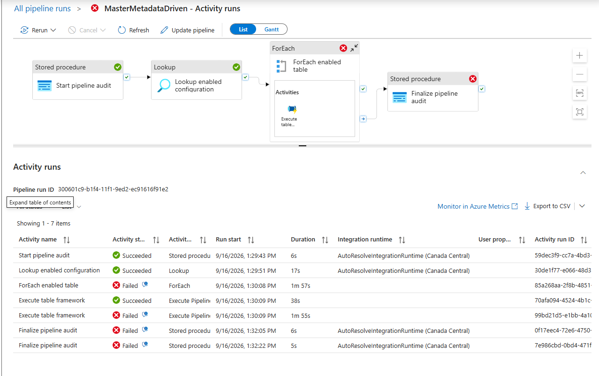
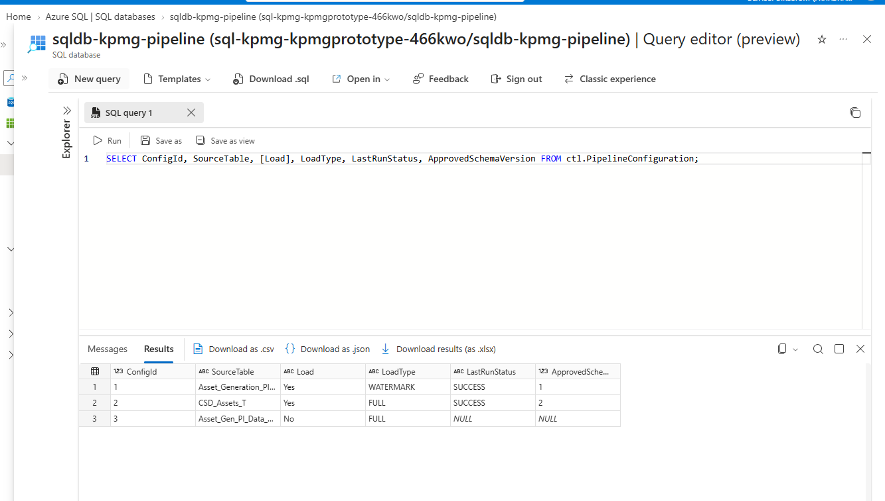
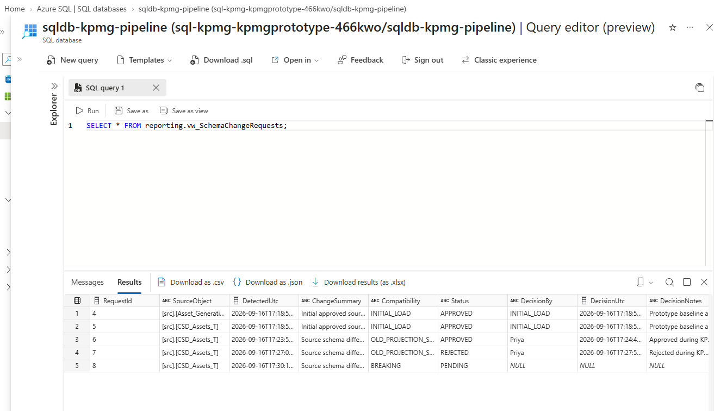
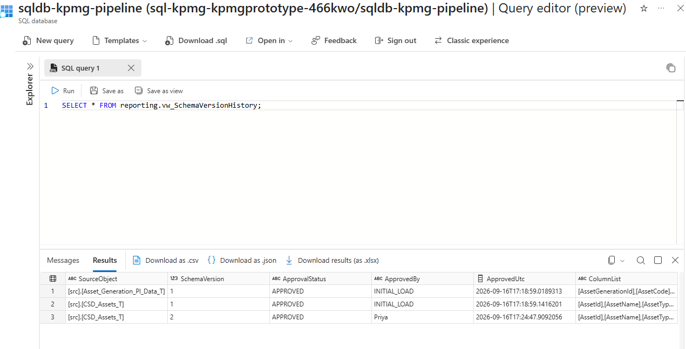
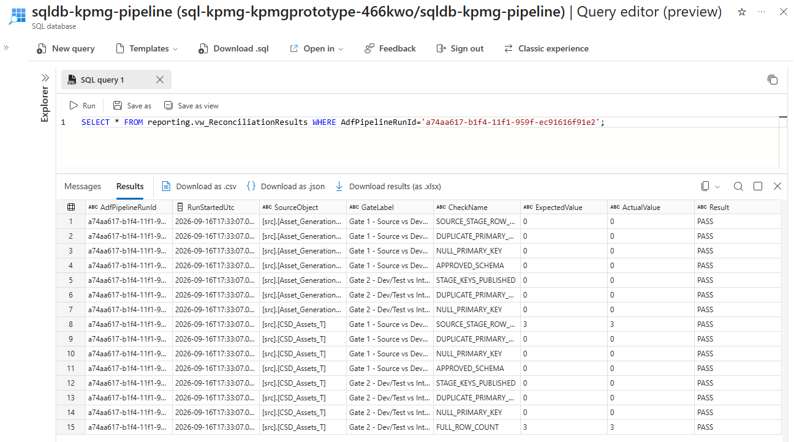
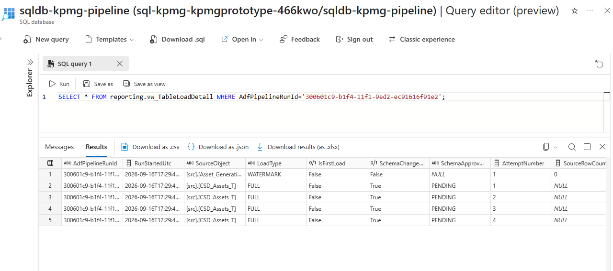
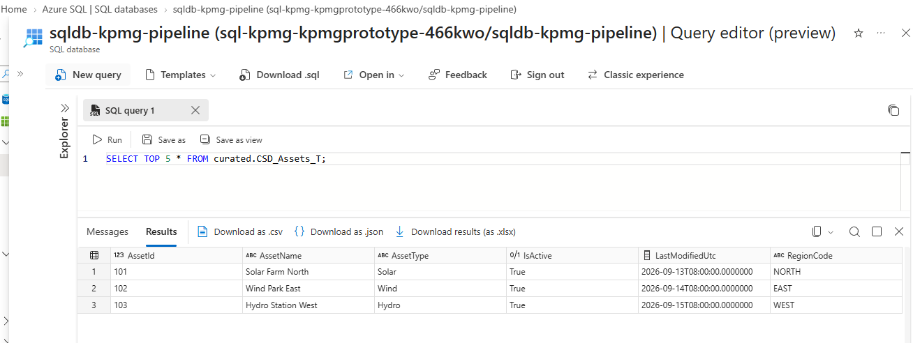

# Evidence

[← README](../README.md)

All screenshots were captured from the live prototype on 2026-09-16.

## Live runs

| # | Scenario | ADF run ID | Result | Screenshot |
|---|---|---|---|---|
| 1 | First load | `9d64382f-b1f2-11f1-a6a0-ec91616f91e2` | Succeeded | [view](../screenshots/data-factory/monitor/01-first-load.png) |
| 2 | Incremental | `d1d44b82-b1f2-11f1-8b2e-ec91616f91e2` | Succeeded | [view](../screenshots/data-factory/monitor/02-incremental.png) |
| 3 | Rerun | `19475339-b1f3-11f1-820e-ec91616f91e2` | Succeeded | [view](../screenshots/data-factory/monitor/03-rerun.png) |
| 4a | New column, pending | `52b3938b-b1f3-11f1-98e1-ec91616f91e2` | Succeeded (old columns) | [view](../screenshots/data-factory/monitor/04a-pending.png) |
| 4b | Approved | `84476d39-b1f3-11f1-a444-ec91616f91e2` | Succeeded (schema v2) | [view](../screenshots/data-factory/monitor/04-approved.png) |
| 5 | Rejected | `f41f95e5-b1f3-11f1-b3d7-ec91616f91e2` | Succeeded (old columns) | [view](../screenshots/data-factory/monitor/05-rejected.png) |
| 6 | Breaking change | `300601c9-b1f4-11f1-9ed2-ec91616f91e2` | 1 table OK, 1 failed after 4 attempts | [view](../screenshots/data-factory/monitor/06-breaking-failure-retries.png) |
| 7 | Recovery | `a74aa617-b1f4-11f1-959f-ec91616f91e2` | Succeeded, all gates pass | [view](../screenshots/data-factory/monitor/07-recovery.png) |

**Breaking change: one table fails, the other succeeds**

## SQL results

- **Config table:** 2 tables with `Load = Yes`, 1 with `No`

  
- **Schema change requests:** 2 initial approvals, 1 approved, 1 rejected, 1 breaking change pending

  
- **Schema versions:** `CSD_Assets_T` v1 → v2

  
- **Gate 1 and Gate 2:** every check passes in the recovery run

  
- **Breaking run:** 4 attempts for the failed table

  
- **Curated table:** approved `RegionCode` present; rejected column absent

  

## Data Factory

- [Master pipeline](../screenshots/data-factory/author/master-metadata-driven.png): Lookup → ForEach → finalize
- [Child pipeline](../screenshots/data-factory/author/child-process-configured-table.png): process, retry ×3, notify
- [Managed identity](../screenshots/data-factory/author/adf-system-assigned-managed-identity.png): system-assigned identity on
- [SQL linked service](../screenshots/data-factory/author/linked-service-managed-identity.png): signs in with the managed identity, no password

## Notifications

- [Gmail send action succeeded](../screenshots/logic-app/gmail-send-action-succeeded.png)
- [Logic App run history](../screenshots/logic-app/run-history.png): 43 successful runs, 0 failed

These prove two separate facts: ADF events reached the primary Logic App, and the Gmail-enabled workflow could send after reauthorization. They do **not** show one captured ADF-triggered event flowing all the way to Gmail.

## Identity and access

- [Security groups](../screenshots/entra/security-groups.png): 4 `grp-kpmg-*` groups
- [Report reader user](../screenshots/entra/report-reader-user-membership.png): tenant work account in the readers group. This does not by itself prove the group has a SQL database role.
- [Key Vault IAM](../screenshots/key-vault/iam-adf-secrets-user.png): group roles inherited from the resource group; ADF has Secrets User
- [Key Vault RBAC mode](../screenshots/key-vault/access-configuration-rbac.png) · [Key Vault networking](../screenshots/key-vault/networking-selected-networks.png)
- [App registration secret](../screenshots/entra/app-registration-secret-expiry.png): short-lived secret, value hidden; the captured credential expired on 2026-09-18
- [MFA / security defaults](../screenshots/entra/security-defaults-mfa.png)

## Azure resources

- [Resource group](../screenshots/azure-portal/resource-group-resources-and-tags.png)
- [SQL compute (free tier, auto-pause)](../screenshots/azure-sql/compute-and-storage-free-tier.png)
- [SQL networking](../screenshots/azure-sql/server-networking-selected-networks.png)
- [SQL Entra-only auth](../screenshots/azure-sql/server-entra-authentication-only.png)
- [Cost analysis](../screenshots/cost-management/rg-cost-analysis.png): about CA$0.23

## CI and reporting

- [GitHub Actions: all PR checks green](../screenshots/github/ci-check-passed.png)
- [Power BI overview](../screenshots/powerBI/PowerBI_home.png) · [Recent runs](../screenshots/powerBI/Recent_Pipeline_runs_DB.png) · [Table health](../screenshots/powerBI/Configure_table_health_db.png)
