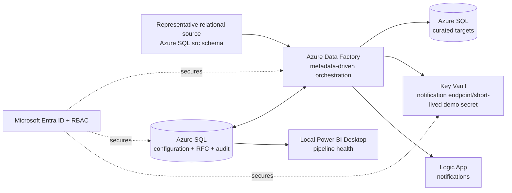
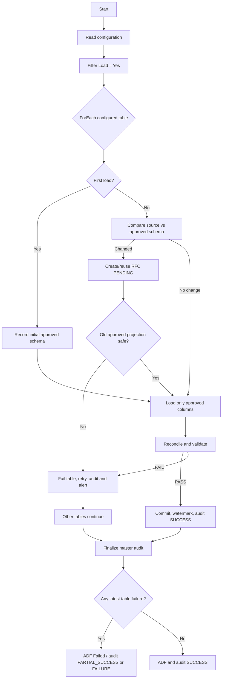

# Priya Learning Guide

This file is for interview preparation, not automatically part of the client submission.

## 1. Business problem

KPMG's client needs a pipeline that loads any configured source table, handles first and later loads, detects random source-schema changes, requires approval before adopting them, validates the result, and exposes data securely. The supplied document does not define source keys, watermarks, delete semantics, or exact reconciliation rules; those are prototype design assumptions.

## 2. Architecture in one sentence

ADF orchestrates one metadata-driven framework; Azure SQL stores sample source data, curated targets, configuration, schema/RFC state, and audit results; managed identity and Key Vault secure runtime access; Logic Apps records notifications; Power BI shows health.

## 3. Components and why

- `ctl.PipelineConfiguration`: says what to load and how. This is what makes the pipeline dynamic.
- `rfc.SchemaHistory`: immutable approved schema versions.
- `rfc.SchemaChangeRequest`: PENDING/APPROVED/REJECTED decision record.
- `audit.PipelineRunAudit`: one master-run summary.
- `audit.TableLoadAudit`: every table attempt, including retries.
- `audit.ReconciliationResult`: PASS/FAIL per validation check.
- `audit.NotificationAudit`: notification intent/delivery evidence.
- ADF master: Lookup plus ForEach; never contains a table-specific branch.
- ADF child: executes one configured table with retry and notification behavior.
- Power BI reporting views: deliberately narrow security boundary over operational metadata.

## 4. Configuration-driven loading

ADF runs one SQL query: enabled configuration rows. Each row supplies `ConfigId`; the child calls the same stored procedure. Adding a valid row with `Load='Yes'` makes it eligible without creating a dataset or pipeline per table. `Load='No'` means it is returned by neither the lookup nor processing loop.

## 5. First, full, and incremental loads

First load means there is no approved schema hash/target. The current schema becomes version 1. A full load stages only approved columns and swaps data transactionally. A watermark load reads rows greater than `LastWatermarkValue`, deletes matching keys, inserts the delta, and advances the watermark only after validation succeeds.

A watermark is the remembered high-water value from the last successful load. If the source cannot guarantee that every insert/update changes it, do not pretend incremental loading is safe—use full load or a real CDC/change-tracking mechanism.

## 6. Idempotency and duplicate prevention

Rerunning the same delta is safe because target rows with the incoming primary keys are deleted before insertion inside one transaction. A failed transaction rolls back. The watermark changes only after commit. Reconciliation checks duplicate and null keys.

## 7. Schema drift and RFC

Every detected difference requires approval in this prototype, matching page 2 literally.

- Added column: old projection is safe, but new column stays out until APPROVED.
- Removed/renamed approved column: breaking; old projection cannot execute, so the table fails safely.
- Datatype change: approval required; widening may be technically compatible, narrowing/incompatible changes can fail conversion and require remediation.
- Nullable to non-nullable: approval required; validate existing nulls before target alteration.
- REJECTED: remember the decision for that exact schema hash, continue old projection when safe, and do not create duplicate RFCs.

Future optimization: auto-approve explicitly safe additive columns after governance agreement. It is not enabled here because KPMG's supplied flow requires approval.

## 8. Reconciliation

The prototype defines “data matches” as row-count comparison, key completeness, duplicate/null-key checks, and approved-schema validation. KPMG did not prescribe these exact tests. PASS commits. FAIL rolls back and marks the table failure. Business-specific rules would be configuration-driven extensions.

## 9. Failure, retry, and restart

ADF performs an initial attempt plus three retries for a configured table. Other ForEach items continue. Audit totals use the latest attempt per `ConfigId`, so four attempts do not become four failed tables. The finalizer writes SUCCESS/PARTIAL_SUCCESS/FAILURE, then deliberately fails the ADF master if any table failed so monitoring is truthful.

## 10. Security

ADF uses managed identity because there is no secret to rotate. The reporting service principal exists only to demonstrate the page-4 app-registration pattern; it can query `reporting` but is denied `curated`. Entra-only SQL, group-based RBAC, MFA for humans, Key Vault, narrow firewall rules, and least privilege are the core controls.

The prototype uses public endpoints because private endpoints are cost-bearing. Production should normally use private connectivity, non-overlapping IP ranges, private DNS, and VPN/ExpressRoute where the client's network requires it.

## 11. Power BI

The report is operational, not a business semantic model. It shows configured/enabled tables, success/failure counts, rows processed, recent run durations, schema decisions, and per-table health. External users are assumed to consume curated outputs through controlled Power BI sharing; the KPMG document does not specify the external-consumption mechanism.

## 12. Important code to explain

- `Lookup enabled configuration`: proves metadata control.
- `ROW_NUMBER() ... PARTITION BY ConfigId`: selects the latest retry outcome for correct totals.
- schema hash: stable comparison of ordered column metadata.
- delete-by-delta-key plus insert in one transaction: idempotent upsert pattern for the prototype.
- `THROW` after final audit: keeps SQL evidence while making ADF monitoring visibly fail.

## 13. Demo story

1. Show three config rows; two Yes and one No.
2. Run first load and show targets plus PASS checks.
3. Update/insert source rows, run incrementally, rerun, and show no duplicates.
4. Add a column: PENDING RFC and old target projection.
5. Approve: new schema version and target column.
6. Reject another additive change: old projection and no duplicate RFC.
7. Rename an approved column: retry, one-table failure, other-table success, truthful ADF failure.
8. Restore and rerun: both succeed.
9. Show Power BI health and security role evidence.

## 14. Non-technical explanation

“Think of the configuration table as a delivery list. ADF reads the list and uses the same delivery process for every marked table. Before accepting a changed package shape, it raises an approval request. It can keep using the last approved contents when that is safe, checks that the delivery matches, records every result, and alerts when it cannot continue safely.”
